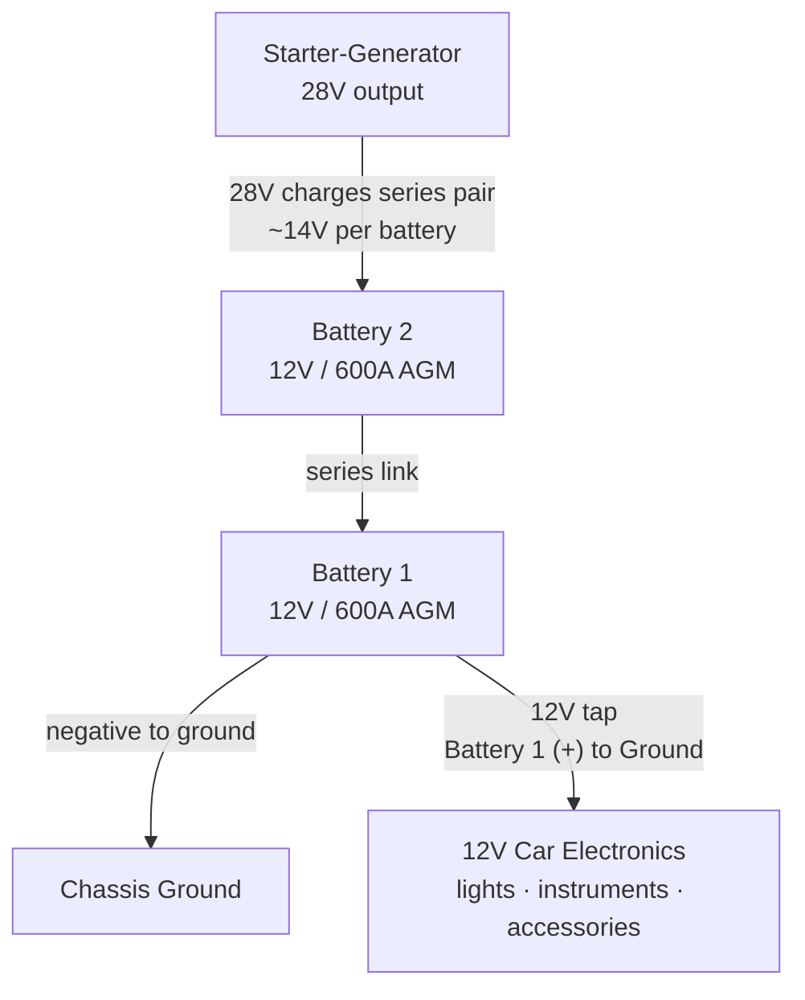
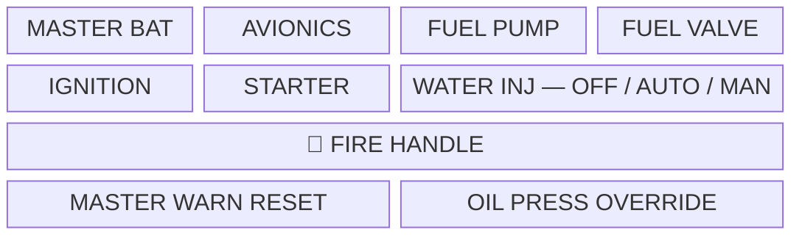
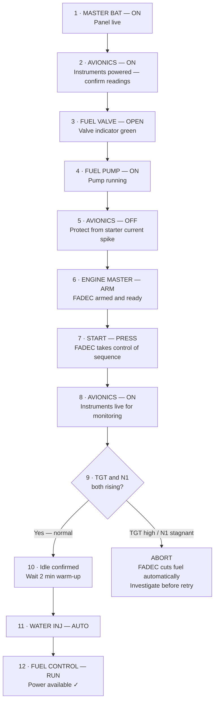
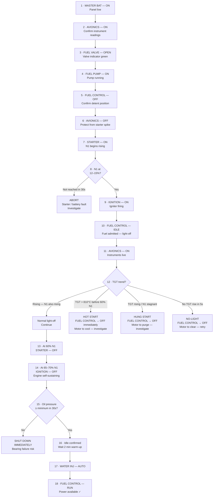
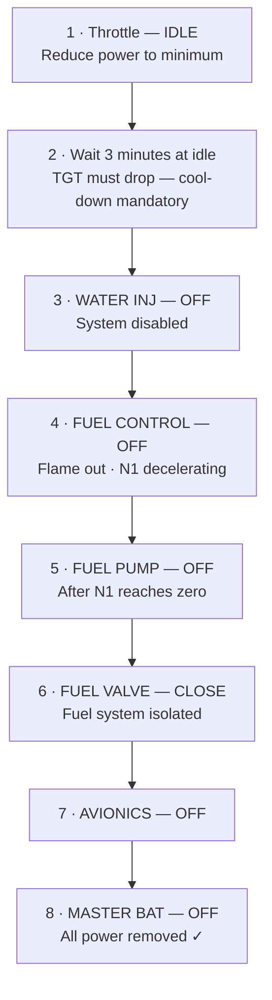
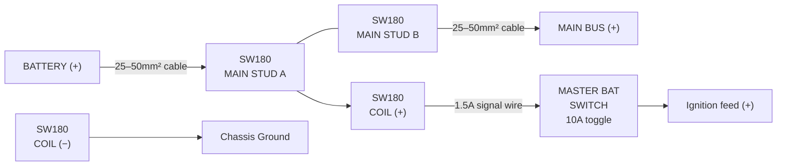
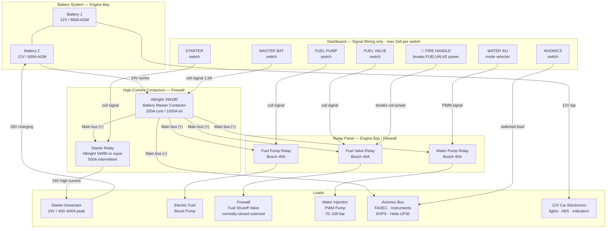
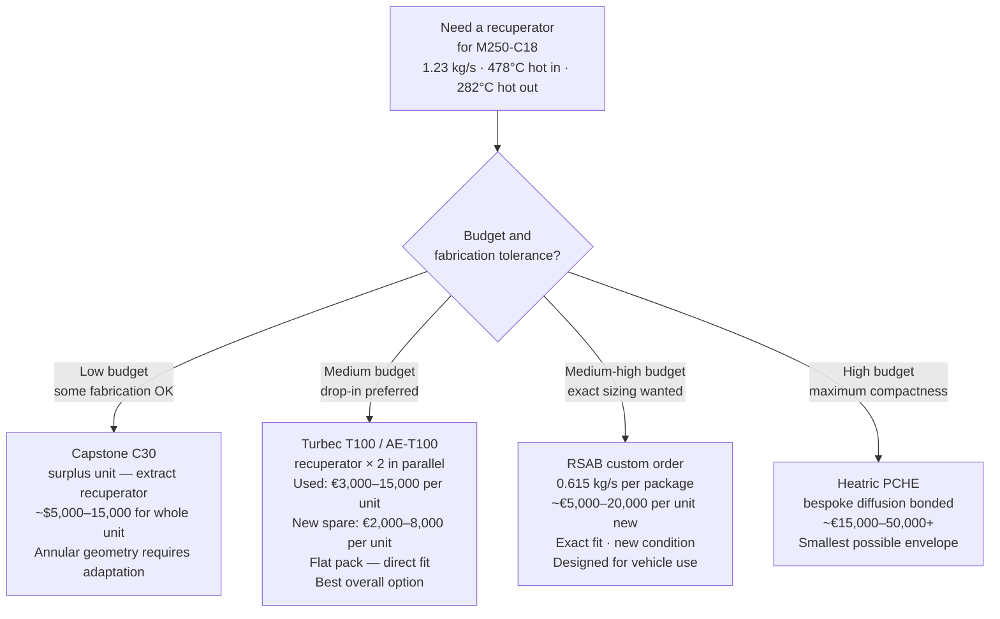
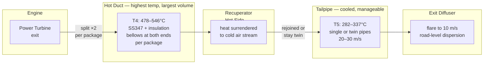
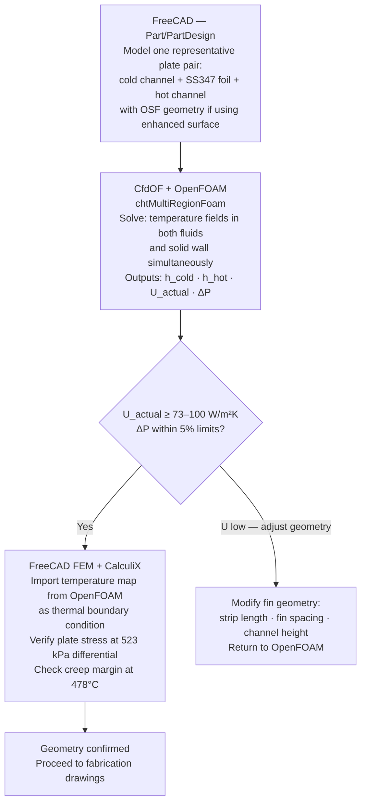

# Recuperated Gas Turbine Car — Concept Design Specification

---

## Table of Contents

- [Historical Background — The Turbine Car Programs](#historical-background--the-turbine-car-programs)

1. [Recommended Engine](#1-recommended-engine)
2. [Output Shaft and Step-Down Gearbox](#2-output-shaft-and-step-down-gearbox)
3. [Mass Flow Rate](#3-mass-flow-rate)
4. [What the Heat Exchanger Does](#4-what-the-heat-exchanger-does)
5. [Recuperator Thermal Summary](#5-recuperator-thermal-summary)
6. [Heat Exchanger Specification](#6-heat-exchanger-specification)
7. [FOD Protection](#7-fod-protection)
8. [Electrical System](#8-electrical-system)
9. [Fuel Cell](#9-fuel-cell)
10. [Fuel Consumption and Range](#10-fuel-consumption-and-range)
11. [Summary Table](#11-summary-table)
12. [Alternative Engine — Lighter Vehicle Application](#12-alternative-engine-suggestion--lighter-vehicle-application)
13. [Lower Power Option — 100 to 200 HP Range](#13-lower-power-option--100-to-200-hp-range)
14. [Acceleration Estimates — All Engines](#14-acceleration-estimates--all-engines)
15. [FADEC Derating — How Power Limiting Works](#15-fadec-derating--how-power-limiting-works)
    - [FADEC Interface and Pinout Documentation](#fadec-interface-and-pinout-documentation)
16. [Time Between Overhaul TBO](#16-time-between-overhaul-tbo)
17. [Three-Engine Comparison Summary](#17-three-engine-comparison-summary)
18. [Compatible Fuels and Seal Materials](#18-compatible-fuels-and-seal-materials)
19. [Water Injection System](#19-water-injection-system)
20. [Air Movement — Volumetric Flow and Pressure Drop](#20-air-movement--volumetric-flow-and-pressure-drop)
21. [Heat Exchanger Plate Geometry — M250-C18](#21-heat-exchanger-plate-geometry--m250-c18)
22. [Ancillary Systems, Costs and Instrumentation](#22-ancillary-systems-costs-and-instrumentation)
23. [IMPORTANT! Turbine Operations — Startup, Shutdown, and Controls](#23-turbine-operations--startup-shutdown-and-controls)
24. [Sourcing the Fuel Control Lever, Relays, and Electrical Components](#24-sourcing-the-fuel-control-lever-relays-and-electrical-components)
25. [Suggested Livery and Markings](#25-livery-and-markings)
26. [Commercially Available and Serviceable Recuperator Options](#26-commercially-available-and-serviceable-recuperator-options)
27. [Exhaust Duct Calculations — All Three Engines](#27-exhaust-duct-calculations--all-three-engines)
28. [CFD and Simulation Tools for Heat Exchanger Analysis](#28-cfd-and-simulation-tools-for-heat-exchanger-analysis)
29. [Plate Pair Spacing — Calculated Values and Surface Enhancement](#29-plate-pair-spacing--calculated-values-and-surface-enhancement)

---

## Historical Background — The Turbine Car Programs

### Why This Concept Has Deep Roots

The gas turbine car is not a new idea. It was pursued seriously and
publicly by multiple major manufacturers across three decades — and
came remarkably close to production. Understanding what was achieved,
what failed, and why it failed is essential context for any modern
revival of the concept.

---

### General Motors Firebird Series — 1953 to 1964

General Motors had been researching the potential of turbine engines
since the 1940s, but it wasn't until the early 1950s that a completed
real-life prototype emerged. The result was a series of four
concept vehicles — the GM Firebird series — each more extreme than
the last, built for the annual Motorama auto shows and never
intended for public sale. These were the Jetsons-era machines that
defined the public imagination of what a turbine car might look like.

**Firebird I (XP-21) — 1953/1954**

The first gas turbine automobile ever built and tested in the United
States. At the heart of the XP-21 was the Whirlfire Turbo-Power gas
turbine engine, capable of producing 370 horsepower at a power turbine
speed of 13,000 rpm, expelling exhaust at 677°C. Its design was
literally that of a jet aircraft on wheels — single seat, glass
canopy, tail fin, delta wings. It was purely a test and show vehicle,
never road-registered.

**Firebird II — 1956**

Unveiled at the GM Motorama in New York City, the Firebird II housed
a gas turbine operating at 35,000 rpm — borderline science fiction
for a road vehicle. Unlike its predecessor it had four seats and
was presented as a genuine family car concept, complete with titanium
body and an early vision of automatic highway guidance. The turbine
was a GT-304 Whirlfire unit producing 200 HP in a more practical
automotive configuration.

**Firebird III — 1959**

The Firebird III was a two-seater powered by a 225 HP Whirlfire
GT-305 gas turbine engine and a separate two-cylinder 10 HP gas
engine to power accessories. It featured seven fins, a
bubble canopy, and a single joystick replacing the conventional
steering wheel. It was displayed widely at auto shows and represents
the high point of GM's turbine showmanship — spectacular, futuristic,
and entirely non-functional as a road car.

**Firebird IV — 1964**

GM coded it internally as the XP-790 and conceived it for a future
in which cars steered automatically via programmed guidance systems.
Though billed as being turbine-powered, the Firebird IV was
non-functional — a pure styling exercise. It was later
repackaged as the Buick Century Cruiser for the 1969 show circuit
and reportedly crushed in the 1980s.

None of the four Firebirds reached public testers. They were
show cars — the primary purpose was to demonstrate GM's
engineering ambition and generate public excitement about the
future of the automobile. The turbine technology in the Firebirds
was real, but the cars themselves were never intended for the road.

---

### Chrysler Turbine Car — The Real Public Test

Where GM used turbines for showmanship, Chrysler used them for
science. Chrysler's turbine programme ran from the late 1930s
through to 1979 — forty years of continuous engineering development
across seven engine generations.

**The Programme History**

The CR2A third-generation engine incorporated a major innovation:
a variable nozzle mechanism acting as a shutter that provided engine
braking. It improved efficiency and fuel economy while reducing the
throttle lag that had plagued the programme from its inception.

The fourth-generation A-831 engine powered the famous Ghia-bodied
Turbine Car of the public loaner programme. After testing,
Chrysler conducted a user program from October 1963 to January 1966
that involved 203 drivers in 133 cities in the United States,
cumulatively driving more than one million miles.

55 cars were distributed to 203 volunteers in 48 states free of
charge for three months each. The power turbine was connected,
without a torque converter, through a gear reduction unit to a
modified TorqueFlite automatic transmission. Twin rotating
recuperators transferred exhaust heat to the inlet air, greatly
improving fuel economy.

**Fuel Consumption — The Honest Figures**

The fuel economy results from the public programme were mixed and
have been reported variously by different sources. The range of
reported figures reflects both the variability of real-world
driving and the enthusiasm with which some drivers chose to exploit
the car's instant torque:

| Source | Reported economy |
|---|---|
| Average fleet figure (Chrysler records) | **13 mpg US (18.1 L/100km)** |
| Best reported (highway) | **18–19 mpg US (12.4–13.1 L/100km)** |
| Typical town driving | **14.5 mpg US (16.2 L/100km)** |
| Worst reported (enthusiastic driving) | **11–11.5 mpg US (20.5–21.4 L/100km)** |
| Contemporary V8 equivalent car | ~15 mpg US (15.7 L/100km) |

About one in four test drivers stated dissatisfaction with the fuel
economy. Chrysler blamed the poorer results on drivers showing off
the cars, regarding their own reading of 14.5 mpg as more accurate.
At 14.5 mpg the turbine was only fractionally below the national
average for a car of its size.

---

### What Killed the Programme — The 1970s Fuel and NOx Crisis

The Chrysler turbine programme did not die from engineering failure.
It was killed by two external forces arriving simultaneously in the
early 1970s.

**1. The NOx Regulatory Crisis**

The A-831's fatal regulatory issue came from the same characteristic
that made it so different. Because it burned fuel continuously at
combustion temperatures between 1,700 and 2,500°F, nitrogen oxide
output ran significantly higher than a piston engine operating at
equivalent power. When the EPA was formed in 1970 and empowered by
the Clean Air Act, it listed NOx as a criteria pollutant requiring
compliance from every road vehicle sold in the US.

Chrysler received a $6.4 million EPA development contract in 1972
specifically to address the NOx problem, and a seventh-generation
turbine engine with improved emissions and fuel economy followed.
A turbine-powered Chrysler LeBaron was built in 1977 as a potential
production preview. But the regulatory timeline was short,
the development costs were enormous, and Chrysler's financial
position in the late 1970s was parlous. The programme was
abandoned in 1979.

**2. The 1973 and 1979 Oil Crises**

The fuel crises of 1973 and 1979 fundamentally shifted public and
regulatory attention toward fuel economy above all else. A turbine
running at 13 mpg average — equivalent to a V8 — was no longer
acceptable at a time when the national conversation had shifted
entirely to miles per gallon. The turbine's advantages — low
maintenance, multi-fuel capability, smooth operation, instant
torque — were simply not the advantages anyone cared about anymore.

The irony of the whole programme is that the NOx problem was a
genuine engineering challenge, but not a fundamental dead end.
The window to solve it closed before Chrysler had the resources
or the regulatory timeline to finish the work.

---

### How Much Turbine Technology Has Improved Since Then

The 1963 A-831 combustor was a simple diffusion flame design — fuel
and air injected separately, burning at stoichiometric hot spots
that inevitably generated high NOx. The technology available today
is fundamentally different.

**NOx Reduction — Five Decades of Progress:**

Advances in lean premix Dry Low NOx (DLN) combustion technology
have lowered NOx emissions from the 150–300 ppm level of the 1980s
to the 15–40 ppm level today, depending on the size and type of
unit. This 90% reduction through cost-effective pollution prevention
is unmatched by any other industrial sector.

Modern lean-premix systems can achieve NOx emissions of 5 ppmvd
and sometimes lower when firing gas. Even on liquid fuels,
water injection into the combustor flame zone reduces NOx by about
40% when half as much water as fuel is injected.

**Fuel Consumption Comparison — 1963 vs Modern:**

| Parameter | Chrysler A-831 (1963) | Modern M250-C18 recuperated | Improvement |
|---|---|---|---|
| Engine power | 130 HP | 250 HP continuous | — |
| Recuperator | Rotary regenerator | Fixed plate — no moving parts | More reliable |
| Recuperator effectiveness | ~91–97% | ~90% | Comparable |
| Fuel consumption (cruise) | ~13 mpg (18 L/100km) | ~51 L/hr at 220 SHP (see §10) | Similar per HP — more absolute power |
| NOx (combustor type) | Diffusion flame — ~500+ ppm | Modern annular — 15–40 ppm | **~90–95% lower** |
| CO | Low (turbine burns clean) | Near zero | Similar |
| Particulates | Low | Near zero on biodiesel | Better |
| Throttle lag | Significant complaint | Much reduced — variable geometry | Improved |
| Cold start | Complicated procedure | FADEC automated | Greatly improved |
| Maintenance | 5 dedicated mechanics for 50 cars | On-condition TBO — 3,500 hrs | Dramatically better |
| Multi-fuel | Yes — diesel, petrol, kerosene | Yes — plus biodiesel, ethanol | Broader |

The NOx column is the most important. What killed the Chrysler
programme in regulatory terms is now reduced by 90–95% through
combustion engineering alone — before any contribution from the
water injection system described in Section 19, biodiesel fuel
(Section 18), or the recuperator's exhaust cooling effect
(Section 4). A modern recuperated turbine car running on biodiesel
with modest water injection would likely meet Euro 6 NOx limits
without any exhaust aftertreatment — something Chrysler could not
have imagined in 1979.

The concept was not wrong. The technology simply needed another
fifty years.

---

## 1. Recommended Engine

**Rolls-Royce M250-C47B**

| Parameter | Value |
|---|---|
| Certification date | ~2000 — within 10–15 year preference window |
| Maximum takeoff power | 650 SHP (485 kW) |
| Continuous derated power | 450–500 SHP (336–373 kW) |
| Engine control | FADEC — single channel electronic with hydromechanical manual backup |
| Configuration | Two-shaft free power turbine |
| Output shaft speed | 6,000 RPM |
| Pressure ratio | 9.2:1 |
| Airflow (mass flow) | 2.77 kg/s (6.1 lb/s) |
| Dry weight | ~72 kg |
| Construction | Modular — compressor, gearbox, turbine, combustion sections separable |

Running derated at 450–500 SHP provides substantial margin below the 650 SHP maximum,
extending TBO (Time Between Overhauls) significantly and reducing thermal stress on all
hot-section components.

---

## 2. Output Shaft and Step-Down Gearbox

The M250-C47B internal gearbox delivers **6,000 RPM** at the output flange. This is
too fast for direct coupling to a conventional automotive transmission or torque converter,
which operate comfortably at 2,000–4,000 RPM input.

**A step-down reduction gearbox is required.**

| Parameter | Value |
|---|---|
| Input speed | 6,000 RPM |
| Required output speed | 2,000–3,000 RPM |
| Reduction ratio | 2:1 to 3:1 |
| Power rating required | 500+ HP continuous |

Suitable off-the-shelf industrial or helicopter accessory gearboxes in this speed and power
range are readily available. Units from within the M250 helicopter ecosystem are an obvious
source, already rated for this exact shaft speed and power level.

---

## 3. Mass Flow Rate

$$\dot{m} = \mathbf{2.77\ kg/s}$$

This is the confirmed published figure for the M250-C40/C47 family at pressure ratio 9.2:1.
Both recuperator packages share this flow equally, each handling **1.385 kg/s**.

---

## 4. What the Heat Exchanger Does

The heat exchanger in this design is a **recuperator** — a static, counterflow,
gas-to-gas plate heat exchanger with no moving parts. It performs five distinct
functions simultaneously, all of which are essential to making a gas turbine
practical in a car.

---

### Function 1 — Waste Heat Recovery (Primary Purpose)

A simple-cycle gas turbine exhausts gas at around **546°C** after the power
turbine has extracted useful work. That represents a large fraction of the
fuel energy simply thrown away. The recuperator captures this heat and
transfers it to the cold compressed air coming from the compressor before
it enters the combustor.

The compressed air arrives at the recuperator cold side at around **260–420°C**
depending on ambient temperature. After passing through the recuperator it
leaves at approximately **456–475°C** — already most of the way to combustion
temperature. The combustor therefore needs to add far less fuel to reach the
required turbine inlet temperature.

The result is a **~30% reduction in fuel consumption** compared to the same
engine running without a recuperator. Without it, the fuel consumption figures
in this document would be unacceptable for a road car. The recuperator is what
makes the concept viable.

---

### Function 2 — Exhaust Cooling

As the hot exhaust gas surrenders its heat to the cold air stream, it cools
dramatically — from ~546°C at the turbine exit to approximately **177–282°C**
at the recuperator hot-side outlet, depending on ambient temperature. This
cooled exhaust then travels through the rear duct to the tailpipe.

Without the recuperator the exhaust would exit at over 500°C — capable of
igniting materials it contacts and certainly damaging road surfaces. The
recuperator makes the exhaust temperature manageable, reducing the
engineering burden on the rear ducting and exit diffuser.

---

### Function 3 — Intake Air Preheating

Preheating the compressed air before it enters the combustor has a secondary
thermodynamic benefit beyond fuel saving. Warmer air entering the combustor
means a more stable, complete combustion process — lower CO and unburned
hydrocarbon emissions, and more consistent combustion across the full power
range. On biodiesel, which has slightly different combustion characteristics
to petroleum diesel, this stable pre-heated intake condition is particularly
beneficial.

---

### Function 4 — FOD Protection

The recuperator cold side — through which fresh ambient air passes on its
way from the intake to the compressor — acts as a natural **Foreign Object
Damage (FOD) barrier**. The narrow plate channels, with their tortuous
counterflow path, physically prevent:

- Insects, leaves, grit, and small stones from reaching the compressor
- Water droplets and ice crystals, separated as air changes direction
  through the core
- Any debris larger than the plate gap dimension

This eliminates the need for a separate **Inlet Particle Separator (IPS)**,
which is a mandatory and bulky fitment on helicopter installations of the
M250 family. A simple coarse mesh screen at the intake scoop is all that
is required upstream of the recuperator.

---

### Function 5 — Partial Exhaust Noise Attenuation

As exhaust gas passes through the narrow plate channels of the hot side,
the acoustic energy in the gas stream is partially absorbed and dissipated
by the plate material and the tortuous flow path. This is not a designed
silencing function, but it is a real side effect — the recuperator acts as
a partial muffler, reducing the high-frequency turbine whine before the
exhaust reaches the rear duct silencer. The Chrysler A-831 turbine car
relied on this same effect from its twin regenerators.

---

### Summary of Recuperator Functions

| Function | Benefit |
|---|---|
| Waste heat recovery | ~30% fuel saving — makes the concept viable |
| Exhaust cooling | Reduces outlet temperature from ~546°C to ~177–282°C |
| Intake air preheating | Cleaner combustion, lower emissions on biodiesel |
| FOD protection | Eliminates need for separate inlet particle separator |
| Partial noise attenuation | Reduces turbine whine before rear silencer |

---

## 5. Recuperator Thermal Summary

### Operating Temperature Range

| Condition | Ambient | Notes |
|---|---|---|
| Cool season start | +5°C | Design case — maximum heat duty |
| Normal operation | +5°C to +35°C | Typical European warm season |
| Worst hot case | +45°C | Southern Europe midsummer |
| Cold storage/transport | −45°C | Non-operating; affects material selection only |

### Cycle State Point Temperatures

| Parameter | +5°C ambient | +20°C ambient | +45°C ambient |
|---|---|---|---|
| Compressor inlet T1 | 278 K (5°C) | 293 K (20°C) | 318 K (45°C) |
| Compressor outlet T2 — cold side IN | 605 K (332°C) | 638 K (365°C) | 692 K (419°C) |
| Turbine exhaust T4 — hot side IN | 819 K (546°C) | 819 K (546°C) | 819 K (546°C) |
| Preheated air T3 — cold side OUT | 814 K (541°C) | 819 K (546°C) | 806 K (533°C) |
| **Final exhaust T5 — hot side OUT** | **610 K (337°C)** | **638 K (365°C)** | **705 K (432°C)** |
| Recuperator heat duty | 582 kW | 504 kW | 318 kW |

### Notes on Final Exhaust Temperature

At +45°C ambient the compressor outlet temperature (419°C) approaches the turbine
exhaust temperature (546°C), leaving only a 127°C differential across the recuperator.
This is a known characteristic of high pressure ratio turbines — recuperation becomes
less effective at high ambient temperatures because the compressor already heats the
intake air substantially.

**A dilution diffuser at the exhaust exit is therefore not optional.** It is a designed
feature required at all operating temperatures to cool exhaust gas before it reaches
road level, and is particularly important on hot days.

The design case for maximum heat duty is the **+5°C cool start scenario** at **582 kW**.

---

## 6. Heat Exchanger Specification

### Design Basis

| Parameter | Value |
|---|---|
| Recuperator effectiveness (ε) | 0.90 (90%) |
| NTU (Number of Transfer Units) | 9.0 |
| Overall heat transfer coefficient (U) | 100 W/m²K (enhanced plate surface) |
| LMTD at design condition | 5°C (counterflow, high effectiveness) |
| Design heat duty | 582 kW at +5°C ambient |

### Total Surface Area

A 20% oversize factor is applied throughout to all recuperators. This provides
margin against fouling, manufacturing tolerances, and part-load operation, and
reduces internal flow velocity, lowering pressure drop.

$$A_{base} = \frac{Q}{U \times LMTD} = \frac{582{,}000}{100 \times 5} = \mathbf{1{,}164\ m^2}$$

$$A_{total} = 1{,}164 \times 1.20 = \mathbf{1{,}397\ m^2}$$

This is **primary wetted surface area** — not external footprint.

### Split Configuration — Two Packages

The recuperator is divided into two equal packages, one mounted each side of the engine,
positioned slightly rearward to keep heat away from forward-mounted accessories,
fuel system components, and electronics. This arrangement mirrors Chrysler's A-831
twin-regenerator layout and provides symmetrical weight distribution.

| Parameter | Per Package | Total |
|---|---|---|
| Base surface area | 582 m² | 1,164 m² |
| **Primary surface area (+20%)** | **698 m²** | **1,397 m²** |
| Core volume (est.) | **~0.82 m³** | ~1.64 m³ |
| Physical envelope (approx.) | **650 × 540 × 230 mm** | — |
| Mass flow handled | 1.385 kg/s | 2.77 kg/s |

### Intake Duct — M250-C47B

At +5°C ambient (density 1.270 kg/m³), 6 m/s approach velocity, per package:

| Parameter | Value |
|---|---|
| Intake volumetric flow (per package) | **1.091 m³/s** |
| Duct area | **1,818 cm² (0.1818 m²)** |
| Round duct diameter | **481 mm** |
| Circumference | **1,511 mm** |

### Construction

| Parameter | Specification |
|---|---|
| Plate geometry | Dimple/bump enhanced primary surface — not corrugated |
| Flow arrangement | Counterflow |
| Joining method | Vacuum brazed |
| Material | SS347 stainless steel |
| Material temperature limit | ~675°C sustained — adequate throughout |
| Hot side inlet temperature | 546°C — within SS347 capability with margin |
| Inconel required? | No — at these operating temperatures SS347 is sufficient |

### Thermal Expansion and Mounting

- Flexible expansion joints at all four duct connections per package
- Floating mounts allowing free axial growth
- Total metal temperature range for stress calculation: **−45°C (storage) to 546°C (operation) = 591°C swing**
- FADEC spool-up sequence limits fuel flow on cold start to allow gradual thermal
  equalisation across the recuperator core — preventing shock loading

---

## 7. FOD Protection

The recuperator layout provides Foreign Object Damage (FOD) protection as a
natural consequence of its design. Fresh combustion air is drawn through the cold
side of the recuperator before reaching the compressor inlet. The narrow plate
channels act as an effective barrier:

- Insects, grit, small stones and debris cannot navigate the tortuous path
  through the plate channels
- Water droplets are separated as air changes direction through the core
- Air arrives at the compressor pre-heated, with particulates removed

**No separate Inlet Particle Separator (IPS) is required.** A simple
weather-proof intake scoop with a coarse mesh screen upstream of the
recuperator cold side inlet is sufficient — a significant simplification
compared to a standard helicopter installation of the M250 which normally
demands a dedicated IPS.

---

## 8. Electrical System

Two 12V / 600A AGM batteries connected in series providing 24V for engine startup.



| Function | Supply |
|---|---|
| Engine startup | 24V across both batteries in series |
| Car electronics (lights, instruments etc.) | 12V tapped at Battery 1 positive to ground |
| Battery charging (running) | Starter-generator 28V charges both batteries in series — each sees ~14V |

No relay, no DC-DC converter, no switching logic required. The physics of the
series circuit isolates the 12V accessories from the high-current startup path
automatically. Both batteries remain healthy and fully charged during normal running.

---

## 9. Fuel Cell

### Available Options — ATL Saver Cell Series

ATL Saver Cells are FIA FT3-1999 approved, constructed from a unique tough plastic
alloy (FIA Homologation No. ATL-565), fully foam-baffled internally, and compatible
with biodiesel fuel. Available off-the-shelf in the following relevant sizes:

| Capacity | Approximate Dimensions (with aluminium container) | Notes |
|---|---|---|
| 100 litres | 671 × 671 × 340 mm (low profile) | Readily available, standard stock item |
| 120 litres | 641 × 465 × 420 mm | Standard stock item |
| 120 litres | 620 × 416 × 535 mm | FIA approved alternative profile |

**Recommended: ATL 120 litre Saver Cell** — maximum within the stated 130-litre
limit, standard stock item, FIA approved, biodiesel compatible with blue foam baffle
specification.

---

## 10. Fuel Consumption and Range

### SFC Basis

The confirmed published SFC for the M250-C47B at cruise power is
**0.65 lb/SHP/hr** (official engine specification database figure).
Running derated at **450 SHP continuous:**

$$\text{Fuel flow} = 450 \times 0.65 = 292.5\ \text{lb/hr} = 132.7\ \text{kg/hr}$$

### Simple Cycle (no recuperator)

$$\text{Fuel flow} = \frac{132.7}{0.88} = \mathbf{150.8\ \text{litres/hr}}$$

*(Biodiesel density ~0.88 kg/litre)*

### Recuperated Cycle

The recuperator improves thermal efficiency by approximately 30% at cruise:

$$\text{Recuperated fuel flow} = 150.8 \times 0.70 = \mathbf{106\ \text{litres/hr}}$$

### Running Time and Range

| Fuel cell | Running time | Range at 82.5 km/hr average |
|---|---|---|
| 50 litres | **28 minutes** | **~39 km** |
| 100 litres | **57 minutes** | **~78 km** |
| **120 litres (recommended)** | **~68 minutes** | **~93 km** |
| Required for 165 km / 2 hrs | — | **~212 litres needed** |

### Range Note

The reference journey of 165 km taking 2 hours requires approximately
**212 litres** of biodiesel at cruise power with recuperation. The
maximum practical fuel cell of 120 litres provides approximately
**93 km range** — sufficient for a convention demonstration, circuit
event, or short-distance showcase run, but not for extended road use
without refuelling.

The fuel consumption is a direct consequence of the M250-C47B's power
level — at 450 SHP derated it is producing roughly 3.5× more power
than the car needs at highway cruise, burning fuel accordingly. A
smaller engine in the 200–250 SHP class provides similar real-world
performance with significantly lower fuel consumption.

---

## 11. Summary Table

| Parameter | Value |
|---|---|
| **Engine** | Rolls-Royce M250-C47B |
| **Maximum power** | 650 SHP |
| **Continuous derated power** | 450–500 SHP |
| **FADEC** | Yes — single channel + hydromechanical backup |
| **Output shaft speed** | 6,000 RPM |
| **Step-down gearbox** | Required — 2:1 to 3:1 reduction |
| **Mass flow rate** | **2.77 kg/s** |
| **Total recuperator surface area (base)** | **1,164 m²** |
| **Total recuperator surface area (+20%)** | **1,397 m²** |
| **Per package surface area (+20%)** | **698 m²** |
| **Per package envelope** | **650 × 540 × 230 mm** |
| **Intake duct diameter (per package)** | **481 mm** |
| **Intake duct circumference** | **1,511 mm** |
| **Recuperator material** | SS347 stainless steel |
| **Hot side inlet temperature** | 546°C |
| **Final exhaust temperature** | 337°C (design case +5°C ambient) |
| **Exhaust dilution diffuser** | Required at all temperatures |
| **FOD protection** | Provided by recuperator cold side channels |
| **Fuel** | Biodiesel (B100) |
| **Fuel cell** | ATL 120L Saver Cell — 641 × 465 × 420 mm |
| **Recuperated fuel flow** | ~106 litres/hr at 450 SHP |
| **Range on 120 litres** | **~93 km / ~68 minutes** |
| **Electrical startup** | 24V — 2 × 12V / 600A AGM batteries in series |
| **Car electronics supply** | 12V tapped at Battery 1 positive terminal to ground |

---


---

## 12. Alternative Engine Suggestion — Lighter Vehicle Application

### Rationale

For a vehicle weighing 1,200–1,500 kg the M250-C47B at 650 SHP maximum is
significantly oversized. A 1,400 kg car requires approximately **150–200 HP (112–149 kW)**
for brisk but civilised road performance — responsive in traffic, capable of comfortable
highway cruising, but not extreme. A turbine in the **200–300 SHP range** provides
genuine performance with headroom, without the fuel appetite of the C47B.

Two candidates are well suited:

---

### Candidate A — Rolls-Royce RR300

| Parameter | Value |
|---|---|
| Type | Twin-spool free-turbine turboshaft |
| Certification | February 2008 (FAA) — within preference window |
| Maximum takeoff power | **300 SHP (224 kW)** |
| Maximum continuous power | **240 SHP (179 kW)** |
| Engine control | **FADEC** |
| Pressure ratio | **6.2:1** |
| Output shaft speed | ~6,000 RPM (M250 family standard) |
| Dry weight | **79.8 kg (176 lb)** |
| Length | 1,041 mm |
| SFC at cruise | **0.63 lb/SHP/hr** |
| Compressor | Single-stage centrifugal (titanium) |
| Turbine | 2-stage gas producer + 2-stage free power turbine |
| Primary application | Robinson R66 helicopter |
| Airflow | ~1.8 kg/s (estimated, scaled from M250 family at 6.2:1 PR) |

The RR300 is a direct M250 family derivative — sharing the same modular layout,
gearbox interface, and support ecosystem — making it an extremely practical choice.
FADEC is standard. The lower pressure ratio of 6.2:1 versus the C47B's 9.2:1 means
the compressor outlet temperature is lower, which actually makes recuperation more
effective at all ambient temperatures.

---

### Candidate B — Turbomeca (Safran) Arrius 2F

| Parameter | Value |
|---|---|
| Type | Twin-spool free-turbine turboshaft |
| Certification | November 1996 (EASA/FAA) |
| Maximum takeoff power | **504 SHP (376 kW)** |
| Continuous derated target | **200–250 SHP (149–186 kW)** |
| Engine control | Hydromechanical fuel control (not FADEC) |
| Pressure ratio | ~7.5:1 |
| Output shaft speed | ~6,000 RPM via reduction gearbox |
| Dry weight | **101.3 kg (223 lb)** |
| Length | 1,601 mm |
| Airflow | **~1.5 kg/s** |
| Primary application | Eurocopter EC120B Colibri |

**Note:** The Arrius 2F uses a hydromechanical fuel control, not FADEC. This is a
significant disadvantage for this application — FADEC is strongly preferred for
overspeed protection, startup management, and part-load optimisation in a car.
The Arrius 2F is therefore the secondary candidate unless retrofitted with an
aftermarket electronic control system. The RR300 is the preferred choice.

---

### Recommended Alternative: Rolls-Royce RR300

Running derated at **200–220 SHP continuous** from a 300 SHP maximum gives
excellent performance margin, low thermal stress, and extended TBO.

**Power-to-weight comparison for 1,400 kg vehicle:**

| Engine | Continuous power | Power-to-weight (vehicle) |
|---|---|---|
| M250-C47B (derated) | 450 SHP (336 kW) | **240 kW/tonne** — supercar territory |
| RR300 (derated) | 210 SHP (157 kW) | **112 kW/tonne** — very brisk, civilised |

The RR300 at 112 kW/tonne is comparable to a well-specced performance saloon —
excellent acceleration, comfortable in traffic, but not violent. Entirely appropriate
for a warm-season touring car concept.

---

### RR300 Recuperator Calculations

#### Revised Cycle Temperatures — Pressure Ratio 6.2:1

Using the same methodology as Section 4, with PR = 6.2, η_c = 0.80, η_t = 0.85,
ε = 0.90, TIT ≈ 900°C (1,173 K), design case +5°C ambient:

**Compressor outlet T2:**

$$T_{2s} = T_1 \times 6.2^{0.286} = 278 \times 1.735 = 482 \text{ K}$$

$$T_2 = T_1 + \frac{T_{2s} - T_1}{\eta_c} = 278 + \frac{204}{0.80} = \mathbf{533 \text{ K}\ (260°C)}$$

**Turbine exhaust T4:**

$$T_{4s} = 1173 \times (1/6.2)^{0.286} = 1173 \times 0.577 = 677 \text{ K}$$

$$T_4 = 1173 - 0.85(1173 - 677) = 1173 - 422 = \mathbf{751 \text{ K}\ (478°C)}$$

**Recuperator temperatures with ε = 0.90:**

$$T_3 = 533 + 0.9(751 - 533) = 533 + 196 = \mathbf{729 \text{ K}\ (456°C)}$$

$$T_5 = 751 - 0.9(751 - 533) = 751 - 196 = \mathbf{555 \text{ K}\ (282°C)}$$

**Key improvement over M250-C47B:** Final exhaust T5 at design condition is **282°C**
versus **337°C** for the C47B — meaningfully cooler, easing the dilution diffuser
requirement.

#### RR300 Recuperator Temperature Table

| Parameter | +5°C | +20°C | +45°C |
|---|---|---|---|
| T2 — cold side IN | 260°C | 290°C | 335°C |
| T4 — hot side IN | 478°C | 478°C | 478°C |
| T3 — cold side OUT | 456°C | 462°C | 471°C |
| **T5 — final exhaust** | **282°C** | **294°C** | **321°C** |
| Heat duty | 263 kW | 234 kW | 183 kW |

The lower hot-side inlet temperature of **478°C** versus 546°C for the C47B is also
significant — **SS347 is fully adequate with greater margin**, and the risk of
creep is reduced.

---

### RR300 Heat Exchanger Surface Area

**Design case: +5°C ambient, heat duty = 263 kW**

LMTD (counterflow, ε = 0.90):

$$\Delta T_1 = 478 - 456 = 22°C \quad \Delta T_2 = 282 - 260 = 22°C$$

$$LMTD = 22°C$$

$$A_{base} = \frac{Q}{U \times LMTD} = \frac{263{,}000}{100 \times 22} = \mathbf{120 \text{ m}^2}$$

$$A_{total} = 120 \times 1.20 = \mathbf{143 \text{ m}^2}$$

A 20% oversize factor is applied. Split two ways:

| Parameter | Per Package | Total |
|---|---|---|
| Base surface area | 60 m² | 120 m² |
| **Primary surface area (+20%)** | **72 m²** | **143 m²** |
| Core volume (est.) | **~0.085 m³** | ~0.17 m³ |
| Physical envelope (approx.) | **320 × 270 × 100 mm** | — |

### Intake Duct — RR300

At +5°C ambient, 6 m/s approach velocity, per package:

| Parameter | Value |
|---|---|
| Intake volumetric flow (per package) | **0.736 m³/s** |
| Duct area | **1,227 cm² (0.1227 m²)** |
| Round duct diameter | **395 mm** |
| Circumference | **1,242 mm** |

The RR300 recuperator packages are roughly **one-tenth the volume** of those
required for the C47B — compact enough to mount very neatly alongside the
engine with minimal packaging impact.

---

### RR300 Mass Flow Rate

Scaled from the M250 family at pressure ratio 6.2:1 versus 9.2:1:

$$\dot{m}_{RR300} \approx 2.77 \times \frac{6.2}{9.2} \approx \mathbf{1.87 \text{ kg/s}}$$

Each package handles **0.935 kg/s**.

---

### RR300 Step-Down Gearbox

Output shaft speed is the same M250 family standard of approximately **6,000 RPM**.
The same 2:1 to 3:1 step-down gearbox requirement applies as for the C47B.
Being from the same engine family, the same gearbox solutions are applicable.

---

### RR300 Fuel Consumption and Range

**SFC:** 0.63 lb/SHP/hr at cruise (confirmed M250 family figure)

Running at **210 SHP continuous:**

$$\text{Fuel flow} = 210 \times 0.63 = 132.3 \text{ lb/hr} = 60.0 \text{ kg/hr}$$

$$\text{Fuel flow (litres)} = \frac{60.0}{0.88} = \mathbf{68 \text{ litres/hr}}$$

**With recuperator — 30% SFC improvement:**

$$\text{Recuperated fuel flow} = 68 \times 0.70 = \mathbf{48 \text{ litres/hr}}$$

#### Range on Available Fuel Cells

| Fuel cell | Running time | Range at 82.5 km/hr average |
|---|---|---|
| 50 litres | **63 minutes** | **~86 km** |
| 100 litres | **125 minutes** | **~172 km** |
| **120 litres (ATL recommended)** | **~150 minutes (2hrs 30min)** | **~206 km** |

**The 120 litre ATL Saver Cell comfortably exceeds the 165 km / 2-hour target with the RR300.**

This is the critical result. The RR300 at derated cruise power with recuperation
achieves the design range goal on a single standard fuel cell with significant
margin to spare, whereas the M250-C47B requires approximately 212 litres to
achieve the same range.

---

### Comparative Summary — M250-C47B vs RR300

| Parameter | M250-C47B | RR300 | Advantage |
|---|---|---|---|
| Max power | 650 SHP | 300 SHP | C47B |
| Continuous derated | 450–500 SHP | 200–210 SHP | RR300 (right-sized) |
| Vehicle power/weight (1,400 kg) | 240 kW/tonne | 112 kW/tonne | RR300 (appropriate) |
| Mass flow | 2.77 kg/s | ~1.87 kg/s | RR300 (smaller system) |
| Total HX surface area | 1,164 m² | **120 m²** | **RR300** |
| Per package HX envelope | 600×500×230 mm | **300×250×95 mm** | **RR300** |
| Hot side inlet temp | 546°C | **478°C** | **RR300** |
| Final exhaust temp (+5°C) | 337°C | **282°C** | **RR300** |
| FADEC | Yes | **Yes** | Equal |
| Engine weight | ~72 kg | **~80 kg** | C47B (marginal) |
| Recuperated fuel flow | 106 litres/hr | **48 litres/hr** | **RR300** |
| Range on 120 litres | ~93 km | **~206 km** | **RR300** |
| Meets 165 km target? | **No** (needs ~212L) | **Yes** (120L — margin to spare) | **RR300** |
| Step-down gearbox | 2:1–3:1 required | 2:1–3:1 required | Equal |
| FOD protection via HX | Yes | Yes | Equal |
| Electrical system | 24V / 2×12V AGM | 24V / 2×12V AGM | Equal |

### Conclusion

**The Rolls-Royce RR300 is the correct engine for this concept.**

It is right-sized for a 1,200–1,500 kg vehicle, achieves the 165 km range target
on a 120-litre ATL fuel cell, requires a recuperator that is one-tenth the volume
of that needed for the C47B, produces a meaningfully lower final exhaust temperature,
and retains FADEC as standard. The M250-C47B remains a valid alternative where
maximum performance is the priority and fuel range is a secondary concern —
effectively a different vehicle concept entirely.

---


---

## 13. Lower Power Option — 100 to 200 HP Range

### Rationale

A 1,200–1,500 kg car requires only 100–150 HP for relaxed but fully adequate road
performance — comfortable in traffic, capable of sustained highway cruising, and
very economical on fuel. A turbine in this bracket transforms the concept into a
genuinely practical everyday vehicle rather than a performance showcase.

---

### Recommended Engine: Rolls-Royce M250-C18

The original JetRanger engine — the engine that started the M250 family in 1960.
By far the most produced small turboshaft in history.

| Parameter | Value |
|---|---|
| Type | Two-shaft free-turbine turboshaft |
| Certification | 1960s — extremely mature |
| Maximum takeoff power | **317 SHP (236 kW)** |
| Maximum continuous power | **250 SHP (186 kW)** |
| Pressure ratio | **6.2:1** |
| Airflow | **1.23 kg/s** |
| SFC | **0.64 lb/SHP/hr** |
| Output shaft speed | **6,000 RPM** |
| Dry weight | **64 kg (141 lb)** |
| Length | 1,029 mm |
| Diameter | 572 mm |
| Engine control | Hydromechanical (Honeywell/Bendix FCU) |
| FADEC | Not standard — see note below |
| Applications | Bell 206 JetRanger, Hughes 500, MD500 |
| Units produced | 38,000+ (M250 family total) |
| Support network | Global — largest of any small turbine |

**Note on engine control:** The C18 uses a proven hydromechanical fuel control
unit. It is not FADEC-equipped as standard. However an aftermarket **electronic
N2 overspeed protection system** is available and can be fitted — as used on
some later C20 variants. For a car application a standalone automotive ECU
monitoring shaft speed, TGT, and torque, interfaced with the existing
hydromechanical FCU via a torque motor signal, provides effective electronic
governing without a full FADEC certification burden. This is the same approach
used by several industrial M250 installations.

---

### M250-C18 Recuperator Calculations

Pressure ratio 6.2:1 — identical to the RR300. Cycle temperatures are therefore
the same as Section 11 but scaled to lower mass flow.

**Design case +5°C ambient:**

| Parameter | Value |
|---|---|
| T2 cold side inlet | 260°C |
| T4 hot side inlet | 478°C |
| T3 cold side outlet | 456°C |
| T5 final exhaust | 282°C |
| Heat duty | **117 kW** |

$$A_{base} = \frac{117{,}000}{100 \times 22} = \mathbf{53 \text{ m}^2}$$

$$A_{total} = 53 \times 1.20 = \mathbf{64 \text{ m}^2}$$

A 20% oversize factor is applied throughout.

| Parameter | Per Package | Total |
|---|---|---|
| Base surface area | 26.5 m² | 53 m² |
| **Primary surface area (+20%)** | **31.9 m²** | **63.8 m²** |
| Core volume (est.) | **~0.038 m³** | ~0.075 m³ |
| Physical envelope (see Section 21) | **615 × 430 × 389 mm** | — |

### Intake Duct — M250-C18

At +5°C ambient (density 1.270 kg/m³), 6 m/s approach velocity, per package:

| Parameter | Value |
|---|---|
| Intake volumetric flow (per package) | **0.484 m³/s** |
| Duct area | **807 cm² (0.0807 m²)** |
| Round duct diameter | **321 mm** |
| Circumference | **1,007 mm** |
| Rectangular duct (H = 430 mm) | **188 mm wide** |
| Rectangular perimeter | **1,235 mm** |

The C18 recuperator packages are compact — see Section 21 for full plate
geometry at the +20% oversized specification.

---

### M250-C18 Fuel Consumption and Range

Running at **220 SHP continuous** with recuperator (30% SFC improvement):

$$\text{Fuel flow} = 220 \times 0.64 \times 0.70 = \mathbf{98.6 \text{ lb/hr}}
= 44.7 \text{ kg/hr} = \mathbf{51 \text{ litres/hr}}$$

| Fuel cell | Running time | Range at 82.5 km/hr |
|---|---|---|
| 50 litres | **59 minutes** | **~81 km** |
| 100 litres | **118 minutes (1hr 58min)** | **~162 km** |
| **120 litres** | **~141 minutes (2hrs 21min)** | **~194 km** |

The 120 litre cell comfortably exceeds the 165 km target.

---

## 14. Acceleration Estimates — All Engines

### Assumptions

- Vehicle mass: **1,500 kg**
- Layout: **Front engine, rear wheel drive**
- Weight distribution: **55% front / 45% rear** → 675 kg on rear axle
- Rear tyre width: **200 mm**, μ = 1.20 on dry tarmac
- Drivetrain efficiency: **η = 0.88**
- Maximum traction force: 1.20 × 675 × 9.81 = **7,945 N**
- Maximum traction-limited acceleration: 7,945 / 1,500 = **5.30 m/s² (0.54g)**

### Crossover Speeds

| Engine | Wheel power | Crossover speed |
|---|---|---|
| M250-C47B | 427 kW | **193 km/h** — traction limited through entire 0–100 |
| RR300 | 197 kW | **89 km/h** — power limited from 89–100 km/h |
| M250-C18 | 194 SHP (145 kW) continuous / **236 SHP (176 kW) max** → 155 kW wheel | **70 km/h** — power limited from 70–100 km/h |

### Final 0–100 km/h Results

| Engine | Max power | 0–100 km/h | Character |
|---|---|---|---|
| M250-C47B | 650 SHP | **~5.2 s** | Traction-limited throughout — tyre-shredding potential above 100 km/h |
| RR300 | 300 SHP | **~5.2 s** | Near-identical feel to C47B below 100 km/h |
| **M250-C18** | **317 SHP** | **~5.7 s** | 0.5 s slower — still very brisk, most practical |

---

## 15. FADEC Derating — How Power Limiting Works

### What Derating Means

Running a turbine below its certificated maximum power extends component life
dramatically. The hot section — turbine blades, nozzle guide vanes, combustor —
accumulates damage through creep, oxidation, and thermal fatigue at a rate that
is highly non-linear with temperature. Reducing TGT (Turbine Gas Temperature)
by as little as 25°C can double hot-section life.

### How FADEC Implements Derating

A FADEC controls engine power through four simultaneous limit schedules,
each monitored up to 70 times per second. Whichever limit is reached first
wins — the FADEC never allows any parameter to exceed its set value.

**The four primary limits:**

**1. TGT Limit (Turbine Gas Temperature)**
The most important limit for hot-section life. The FADEC monitors the
inter-turbine temperature sensor and caps fuel flow when TGT reaches the
programmed ceiling. Reducing the TGT limit from, say, 810°C to 760°C
reduces available power by roughly 10–15% but dramatically reduces
blade creep and oxidation rate. This is the primary derating tool.

**2. NG Limit (Gas Generator Speed)**
Maximum gas generator RPM is capped in the FADEC software. Lowering
the NG ceiling reduces compressor delivery pressure and temperature,
directly reducing power output while keeping the entire hot section cooler.

**3. Torque Limit (Q)**
For a car application this is the most practically useful limit. The FADEC
monitors shaft output torque via the torquemeter and caps fuel flow when
torque reaches the programmed maximum. This protects the step-down
gearbox and drivetrain rather than the engine itself, but as a side effect
also prevents the engine from reaching peak TGT during normal driving.
Setting a torque limit equivalent to 70% of maximum power achieves
derating without the driver ever feeling a hard power cut — the engine
simply feels like a slightly less powerful unit.

**4. NP Limit (Power Turbine Speed)**
Power turbine overspeed protection — prevents the free power turbine
from exceeding its mechanical speed limit during load rejection events.
Set conservatively for a car application given the absence of a helicopter
rotor's large inertia to absorb transients.

### Derating in Practice for This Car

For the automotive application, the recommended approach is a **dual-mode
FADEC calibration:**

**Touring mode** — TGT limit reduced by 40–50°C below maximum, torque
limit set to approximately 70% of peak. Engine runs cool, fuel consumption
is minimised, TBO is maximised. Normal everyday driving.

**Performance mode** — Full certificated limits restored. Used for overtaking,
hill climbing, or track use. Time at this power level is logged by the FADEC
health monitoring system.

### M250-C18 Without FADEC

For the C18 with its hydromechanical FCU, derating is achieved mechanically
by adjusting the **fuel control unit (FCU) stop** — a physical adjustment that
limits maximum fuel flow regardless of throttle position. This is a well-understood
procedure done routinely on industrial M250 installations. It is less precise than
FADEC but entirely effective, and the adjustment is reversible. Adding an
aftermarket electronic N2 governor provides overspeed protection, and a
simple EGT (exhaust gas temperature) gauge with a warning light provides
the driver with TGT awareness without full FADEC automation.

---

### FADEC Interface and Pinout Documentation

Integrating the FADEC into an automotive installation requires understanding
its electrical interface — which pins carry which signals, what voltage
levels the discrete inputs expect, and how to read fault codes from the
maintenance port. The following are the primary sources.

---

#### Rolls-Royce M250-C47B / RR300 — Official Documentation

**Rolls-Royce M250 Series IV Maintenance Manual**
The definitive source for FADEC wiring diagrams, connector pinouts, and
discrete input/output specifications. Covers the C40, C47, and C47B.

- Available through **Rolls-Royce Customer Portal** for registered operators:
  [https://customers.rolls-royce.com](https://customers.rolls-royce.com)
- Also available via the **Rolls-Royce FIRST Network** — any authorised
  M250 overhaul facility will hold a current copy. Premier Turbines, Essential
  Turbines, and Air Services International are listed FIRST centres.
- IPC (Illustrated Parts Catalogue) and Wiring Manual are separate volumes —
  the Wiring Manual is the pinout reference.

**FAA Type Certificate Data Sheet (TCDS)**
Gives the regulatory baseline for the engine control system — not a pinout
document but confirms the FADEC certification basis and interface requirements.

- TCDS E3EA — M250 family:
  [https://rgl.faa.gov/Regulatory_and_Guidance_Library/rgMakeModel.nsf/0/E3EA](https://rgl.faa.gov/Regulatory_and_Guidance_Library/rgMakeModel.nsf/0/E3EA)

---

#### FADEC Connector and Discrete Input Reference — General

The M250-C47B FADEC uses a **MIL-DTL-38999 Series III** circular connector
— the standard mil-spec connector used across virtually all modern turbine
engine FADECs. This means the physical connector, pin numbering convention,
and insertion/extraction tooling are standardised and documented independently
of the engine manufacturer.

**MIL-DTL-38999 Series III specification:**
[https://quicksearch.dla.mil/qsDocDetails.aspx?ident_number=34797](https://quicksearch.dla.mil/qsDocDetails.aspx?ident_number=34797)

Connector shells, inserts, and contacts are available from:
- **Amphenol Aerospace**: [https://www.amphenol-aerospace.com](https://www.amphenol-aerospace.com)
- **TE Connectivity / Deutsch**: [https://www.te.com/en/industries/aerospace-defense.html](https://www.te.com/en/industries/aerospace-defense.html)

---

#### Turbine FADEC Integration — Community and Builder Resources

For practical automotive integration — not official sources, but
accumulated builder experience:

**Turbine Truck / Turbine Car builders forum threads:**
- **The Garage Journal** — search *turbine FADEC automotive*:
  [https://www.garagejournal.com/forum/](https://www.garagejournal.com/forum/)
- **Home Built Airplanes (HBA) forum** — covers M250 industrial installations
  and FADEC interfacing from experimental aircraft builders:
  [https://www.homebuiltairplanes.com/forums/](https://www.homebuiltairplanes.com/forums/)

**Guy Norris / Aviation Week turbine car coverage** — documents previous
M250 automotive conversions including interface approaches:
[https://aviationweek.com](https://aviationweek.com) — search *M250 automotive*

---

#### FADEC Fault Code Reading — Maintenance Port

The M250-C47B FADEC maintenance port uses an **RS-422 serial interface**
at 19,200 baud. A standard RS-422 to USB adapter (available from Moxa,
Advantech, or generically for €15–40) connected to a laptop running the
Rolls-Royce **CEDAM** (Control and Engine Data Acquisition Module) software
reads fault codes, event logs, and real-time parameter streams.

CEDAM is available to registered operators through the Rolls-Royce customer
portal. Independent access: contact any FIRST Network overhaul centre —
they routinely provide data downloads as a service during pre-buy inspections.

For the RR300, the same RS-422 interface applies. Robinson Helicopter Company
(the R66's manufacturer) documents the maintenance port in their maintenance
manual, which is publicly available:
[https://www.robinsonheli.com/r66-helicopter/](https://www.robinsonheli.com/r66-helicopter/)
— select R66 Maintenance Manual from the publications section.

---

## 16. Time Between Overhaul (TBO)

### M250 Family TBO — Confirmed Data

| Engine | Component | TBO |
|---|---|---|
| M250-C18 (Series II) | Compressor | **3,500 hours** |
| M250-C18 (Series II) | Turbine | **3,500 hours** |
| M250-C18 (Series II) | Gearbox | **On condition** |
| M250-C47B (Series IV) | Turbine | **2,000 hours** |
| M250-C47B (Series IV) | Gearbox | **On condition** |
| RR300 | Engine (all modules) | **2,000 hours** |

### What TBO Means in Practical Terms

| Engine | TBO | Years at 200 hrs/yr |
|---|---|---|
| M250-C18 | 3,500 hrs | **~17 years** between overhauls |
| RR300 | 2,000 hrs | **~10 years** between overhauls |
| M250-C47B | 2,000 hrs (turbine) | **~10 years** between overhauls |

### Effect of Derating on TBO

Running derated in touring mode — with TGT reduced by 40–50°C — has a
profound effect on hot-section life. The industry rule of thumb is that every
15°C reduction in TGT **doubles the creep life** of turbine blades. A 45°C
reduction therefore multiplies blade life by approximately 8×. In practice
this means a derated C18 in automotive use could realistically achieve
**5,000–6,000 hours** between hot section inspections.

---

## 17. Three-Engine Comparison Summary

| Parameter | M250-C47B | RR300 | M250-C18 |
|---|---|---|---|
| Max power | 650 SHP | 300 SHP | 317 SHP |
| Continuous power | 450–500 SHP | 240 SHP | 250 SHP |
| Mass flow | 2.77 kg/s | ~1.87 kg/s | **1.23 kg/s** |
| Pressure ratio | 9.2:1 | 6.2:1 | 6.2:1 |
| HX base area (total) | 1,164 m² | 120 m² | 53 m² |
| **HX area +20% (total)** | **1,397 m²** | **143 m²** | **64 m²** |
| **Per package HX area +20%** | **698 m²** | **72 m²** | **31.9 m²** |
| Per package HX envelope | 650×540×230 mm | 320×270×100 mm | **615×430×389 mm** |
| Intake duct diameter (per pkg) | 481 mm | 395 mm | **321 mm** |
| Intake duct circumference | 1,511 mm | 1,242 mm | **1,007 mm** |
| Engine weight | ~72 kg | ~80 kg | **64 kg** |
| FADEC | Yes | Yes | No (see §15) |
| TBO — turbine | 2,000 hrs | 2,000 hrs | **3,500 hrs** |
| Recuperated fuel flow | 106 L/hr | 48 L/hr | **51 L/hr** |
| Range on 120L | ~93 km | ~206 km | **~194 km** |
| 0–100 km/h | ~5.2 s | ~5.2 s | ~5.7 s |
| Support network | Excellent | Excellent | **Best of all** |
| Relative cost | High | Medium | **Lowest** |
| Best suited for | Performance showcase | Balanced touring | Practical daily use |

---

## 18. Compatible Fuels and Seal Materials

### Table A — Liquid Fuel Candidates

| Fuel | Source | NOx vs Diesel | CO | Particulates | SO₂ | Seal Risk | Notes |
|---|---|---|---|---|---|---|---|
| **Bio-ethanol 80%** (hydrous) | Fermentation | **Much lower** | Low | Near zero | Zero | High — FKM required | 20% water cools flame further. ~1.6× fuel flow. Best NOx of all liquid options |
| **Anhydrous bio-ethanol** | Fermentation | **Lower** | Low | Near zero | Zero | High — FKM required | No water benefit. Still burns cool vs diesel |
| **Bio-methanol** | Biomass/waste | **Lower** | Low | Near zero | Zero | Very high — FKM + PTFE essential | Lowest flame temp of common alcohols. Toxic — handling precautions needed |
| **Biodiesel B100** | Vegetable oil / animal fat | **Slightly lower** | Lower | Near zero | Zero | Medium — FKM preferred | Best balance of NOx, energy density and range. Recommended primary fuel |
| **HVO** (Hydrotreated vegetable oil) | Vegetable oil | **Similar to diesel** | Lower | Near zero | Zero | Low — standard seals acceptable | Chemically close to kerosene. Excellent cold weather performance |
| **Jet A-1 / kerosene** | Petroleum / synthetic | Baseline | Low | Low | Low | Low — standard seals acceptable | Chrysler's preferred fuel. Very wide availability |
| **Diesel (EN590)** | Petroleum | Baseline | Low | Low | Low | Low — standard seals acceptable | Widely available. Higher viscosity than kerosene |
| **Leaded petrol (100LL Avgas)** | — | — | — | — | — | — | **AVOID — lead destroys turbine nozzle guide vanes irreversibly** |

### Table B — Seal and Gasket Material Compatibility

| Seal Material | Common Name | Petroleum Diesel | Biodiesel B100 | Ethanol / Methanol | Vegetable Oil | Notes |
|---|---|---|---|---|---|---|
| **FKM** | Viton | ✓ Excellent | ✓ Good | ✓ Good | ✓ Good | **Best overall choice for multi-fuel use** |
| **PTFE** | Teflon | ✓ Excellent | ✓ Excellent | ✓ Excellent | ✓ Excellent | **Universally compatible — use for hose liners and static seals** |
| **NBR** | Nitrile / Buna-N | ✓ Good | ✗ Poor | ✗ Poor | ✗ Poor | Standard automotive seal. Swells badly in biodiesel and alcohols. Avoid |
| **EPDM** | — | ✗ Poor | ✗ Very poor | ✓ Fair | ✗ Poor | Not compatible with petroleum or biodiesel fuels. Avoid |

**Practical recommendation:** Specify **FKM (Viton) for all O-rings and dynamic seals**,
**PTFE-lined hose throughout**, and **stainless steel fittings**.

---

## 19. Water Injection System

### Purpose

Water injection serves two simultaneous roles in this concept:

- **NOx reduction** at all power levels — water vapour entering the combustor
  lowers peak flame temperature, directly suppressing thermal NOx formation
- **Power augmentation on demand** — higher injection rates cool and densify
  the intake air, increasing compressor mass flow

### System Summary

| Parameter | Value |
|---|---|
| Water source | Rainwater from household downspout |
| Filtration | Coarse mesh inlet + 50–100 micron cartridge filter |
| Storage tank | 15–25 litres — stainless or HDPE |
| Operating pressure | 70–100 bar |
| Pump control | **PWM — duty cycle proportional to throttle position** |
| Droplet size | <20 micron — complete evaporation before compressor |
| Injection point | Upstream of recuperator cold side inlet |
| Cruise injection rate | 0.3–1.0 L/min |
| Full power injection rate | 4.0–5.0 L/min |
| NOx effect | 20–35% reduction at cruise rates |
| Power augmentation | 10–15% additional shaft power at full rate |
| Running dry | No engine damage — returns to normal dry rating |

| Throttle position | PWM duty cycle | Injection rate | Effect |
|---|---|---|---|
| Idle | 0% | Off | No injection |
| Light cruise | 10–20% | ~0.3–0.5 L/min | Mild NOx reduction |
| Normal cruise | 20–40% | ~0.5–1.0 L/min | Steady NOx reduction |
| Hard acceleration | 60–80% | ~2.0–3.0 L/min | NOx reduction + power augmentation |
| Full throttle | 100% | ~4.0–5.0 L/min | Maximum augmentation |

---

## 20. Air Movement — Volumetric Flow and Pressure Drop

### Complete Air Movement Summary

| Parameter | M250-C47B | RR300 | M250-C18 |
|---|---|---|---|
| Mass flow | 2.77 kg/s | 1.87 kg/s | 1.23 kg/s |
| **Intake volumetric flow (+5°C)** | **2.18 m³/s** | **1.47 m³/s** | **0.97 m³/s** |
| Cold side volumetric flow (pressurised) | 0.543 m³/s | 0.402 m³/s | 0.265 m³/s |
| **Hot side vol flow at T4 (turbine exit)** | **6.20 m³/s** | **3.84 m³/s** | **2.53 m³/s** |
| **Final exhaust vol flow at T5 (tailpipe)** | **4.62 m³/s** | **2.84 m³/s** | **1.87 m³/s** |
| Max total pressure drop (5% rule) | 46.6 kPa | 31.4 kPa | 31.4 kPa |
| Max cold side pressure drop | ~28 kPa | ~19 kPa | ~19 kPa |
| Max hot side pressure drop | ~18 kPa | ~12 kPa | ~12 kPa |
| Single tailpipe diameter — 20 m/s | 542 mm | 425 mm | 345 mm |
| Single tailpipe diameter — 30 m/s | 443 mm | 347 mm | 281 mm |
| Twin tailpipes each — 20 m/s | 383 mm | 300 mm | 244 mm |
| Twin tailpipes each — 30 m/s | 313 mm | 245 mm | 199 mm |
| Hot duct per package — 15 m/s | 513 mm | 404 mm | 327 mm |

Full exhaust duct calculations including hot duct, tailpipe options, diffuser,
and circumferences are in Section 27.

Every 1% of compressor delivery pressure lost to recuperator pressure drop reduces
cycle thermal efficiency by approximately **0.3–0.5 percentage points** — directly
increasing fuel consumption. Staying within 5% total is critical to achieving the
recuperator's claimed 30% fuel saving.

---

## 21. Heat Exchanger Plate Geometry — M250-C18

### Complete Package Summary — M250-C18 (+20% Oversize)

The plate count is recalculated to deliver 20% more primary surface area than the
minimum required at cruise power. This is the governing design, replacing the
earlier 96-plate figure.

| Parameter | Value |
|---|---|
| **Plate height** | **430 mm** |
| **Plate length** | **615 mm** |
| **Plate thickness** | **0.10 mm SS347 foil** |
| **Ridge orientation** | Longitudinal — parallel to flow |
| **Cold side ridge height** | **1.5 mm** |
| **Hot side ridge height** | **5.0 mm** |
| **Ridge pitch** | **20 mm centre to centre** |
| **Ridges per plate** | **21** |
| **Plate stampings** | **Two** — cold plate and hot plate alternating |
| **Plates per package (+20%)** | **116** |
| **Plate pairs per package** | **58** |
| **Cell pitch** | **6.70 mm** |
| **Stack height** | **389 mm** |
| **Package envelope** | **615 × 430 × 389 mm** |
| **Base area per package** | 26.5 m² |
| **Area per package (+20%)** | **31.9 m²** |
| **Cold side channel velocity** | **4.0 m/s** |
| **Hot side channel velocity** | **10.6 m/s** |
| **Intake duct (rectangular)** | **430 × 188 mm** |
| **Intake duct area** | **807 cm²** |
| **Intake duct (round equivalent)** | **321 mm diameter** |
| **Round duct circumference** | **1,007 mm** |
| **Rectangular duct perimeter** | **1,235 mm** |
| **Diffuser expansion ratio** | **3.2:1** (188 → 615 mm width) |
| **Engine bay fit confirmed** | **Yes — 430 × 615 mm fits** |

**Note on cold side velocity:** At 4.0 m/s the cold channel velocity is slightly
below the 5–10 m/s design target. This is a direct consequence of the 20% area
oversize — more plates mean more total channel cross-section, reducing velocity
at the same mass flow. Lower velocity is beneficial: it reduces cold side pressure
drop and increases dwell time in the channels, both improving recuperator
performance. The hot side at 10.6 m/s remains within its 10–15 m/s target range.

---

## 22. Ancillary Systems, Costs and Instrumentation

### Power Steering — Electric Hydraulic Pump (EHPS)

**Recommended unit: Volvo S40/V50/C30 EHPS pump (2006–2012)**

| Parameter | Value |
|---|---|
| Supply voltage | **12V** from Battery 1 |
| Current draw | ~20–25A at full lock, ~5A at straight-ahead cruise |
| Controller | Reform Motorsports EHPS-Micro or equivalent |
| Approximate cost | **€80–150** for used OEM pump + **€60–100** for controller |

### Brake Booster — Hella UP30 Electric Vacuum Pump

| Parameter | Hella UP30 |
|---|---|
| Application | **Standalone — sole vacuum source** |
| Rated voltage | **14.0V** |
| Current draw | **<15A** |
| Max vacuum | **≥86% of ambient** |
| Time to 50% vacuum | **≤3.5s** |
| Booster volume | **4.0 litres** |
| Pump operating life | **1,200 hours** |
| Approximate cost | **€80–150** |

The UP30 is the correct unit — rated for standalone operation without any engine
vacuum source. The UP28 is a support unit only and must not be used here.

### Turbine Engine Instrumentation

| Instrument | Parameter | Type | Notes |
|---|---|---|---|
| **TGT gauge** | Turbine Gas Temperature | Thermocouple + analogue dial | Self-powered — no external supply needed |
| **N1 gauge** | Gas generator speed (%) | Tachometer — % RPM | Monitors compressor/gas generator speed |
| **Torque gauge** | Output shaft torque (%) | Pressure-based or electronic | Primary power indicator |
| **Oil pressure** | Engine oil pressure | Pressure gauge | Critical — low oil pressure = immediate shutdown |
| **Oil temperature** | Engine oil temperature | Temperature gauge | Monitors lubrication health |
| **Fuel flow** | Litres per hour | Flow meter | Range management |
| **Fuel level** | Tank contents | Float sender + gauge | Standard automotive sender in ATL cell |
| **FADEC warning light** | Fault indication | Single warning light | Wired to FADEC fault output |
| **Water level** | Injection tank | Sight gauge or float sender | Low level warning |

**Approximate instrumentation cost: €500–1,500** for a complete analogue set from aviation surplus.

### Engine Cost — M250-C18

| Condition | Price range (USD) |
|---|---|
| Core / run-out | $5,000–15,000 |
| Serviceable — time continued | **$15,000–35,000** |
| Recently overhauled (SMOH) | $40,000–70,000 |

### Complete Ancillary System Cost Summary

| Item | Approx. cost |
|---|---|
| M250-C18 engine (serviceable) | **$15,000–35,000** |
| Pre-buy inspection | $500–1,500 |
| EHPS pump + controller | €140–250 |
| Hella UP30 vacuum pump | €80–150 |
| Turbine instrumentation | €500–1,500 |
| **Total with engine** | **~$17,000–40,000 + €720–1,900** |

---


## 23. IMPORTANT! Turbine Operations — Startup, Shutdown, and Controls

### Overview

A gas turbine engine is not operated like a piston engine. It has its own
logic, its own sequence dependencies, and its own failure modes during the
most vulnerable phase of its life — the start. The majority of gas turbine
failures occur during startup, not during cruise. Understanding why each
switch exists, what it does, and what happens if it is operated out of
sequence is the foundation of safe turbine operation. This section covers
startup and shutdown procedures for both the FADEC-equipped engines (M250-C47B
and RR300) and the hydromechanical-controlled M250-C18, then defines the full
switch and control set required for the automotive installation with the
reasoning behind each item.

---

### The Three Phases of Every Turbine Start

Regardless of engine type or control system, every gas turbine start passes
through the same three physical phases. The control system — FADEC or
hydromechanical — manages these phases differently, but the underlying physics
is identical.

---

**Phase 1 — Motoring (Cranking)**

The starter motor spins the gas generator (N1/NG spool) from rest. No fuel is
admitted. The compressor is building pressure and airflow through the engine.
This phase continues until N1 reaches the minimum speed at which the engine
can sustain combustion and avoid a hung start or compressor surge — typically
**10–15% N1** for the M250 family.

This phase is critical for two reasons. First, the compressor must be moving
enough air to cool the combustor and turbine nozzles before fuel is lit. If
fuel is admitted at too low a speed the combustion gases cannot be adequately
cooled and the turbine inlet temperature rises instantly to damaging levels —
a hot start. Second, the fuel nozzle must be presenting fuel at a pressure and
atomisation quality sufficient to ignite reliably. Below a minimum N1 the fuel
flow is too low and the droplet size too large. Motoringwithout fuel first is
not optional — it is what saves the hot section from the start.

---

**Phase 2 — Light-Off and Acceleration**

At the minimum motoring speed, the igniter fires and fuel is admitted.
Combustion begins — this is light-off. TGT (Turbine Gas Temperature) rises
rapidly. The engine must now accelerate under its own power fast enough to
avoid:

- **Hot start** — TGT rising faster than the engine can accelerate, cooking
  the turbine nozzle guide vanes. Caused by too much fuel admitted too early,
  or a fuel nozzle partially blocked producing uneven combustion.
- **Hung start** — the engine lights off but fails to accelerate past a low
  N1 — typically 30–50% — because fuel flow is insufficient to produce enough
  energy to overcome compressor drag. TGT climbs slowly, N1 refuses to rise.
  The engine is producing heat without useful work. Requires immediate fuel
  cutoff and investigation.
- **No-light** — the igniter fires, fuel is admitted, but no combustion occurs.
  TGT does not rise. The engine motored through the start sequence with no
  ignition. Causes: failed igniter, contaminated fuel nozzle, fuel shutoff
  valve not fully open, low fuel pressure.

This phase ends when N1 reaches self-sustaining speed — typically **60–65%
N1** for the M250 family — at which point the starter motor cuts out. The
engine is now running under its own combustion energy.

---

**Phase 3 — Stabilisation and Idle**

N1 accelerates from self-sustaining speed to ground idle — typically
**62–68% N1** for the M250 family — under FADEC or FCU governing. TGT
settles to its idle value. Oil pressure rises to operating range. NP
(power turbine speed) comes to its governed idle value. The engine is now
stable and ready for load.

A warm-up period at idle — **minimum 2 minutes** — is required before any
significant torque load is applied. During this period:

- Oil is circulating to all bearings and reaching operating temperature.
- The recuperator core is warming from ambient to its steady-state
  temperature distribution — a 591°C swing from cold storage to operating
  temperature requires controlled, gradual heating to prevent thermal shock
  across the vacuum-brazed joints.
- FADEC is running its health monitoring checks and confirming all
  sensor readings are within limits.

Applying full throttle immediately after light-off — even if the engine
reaches idle — causes thermal shock in the recuperator and oil starvation
in bearings that have not yet received fully warmed, low-viscosity lubricant.

---

### FADEC Startup — M250-C47B and RR300

The FADEC (Full Authority Digital Engine Control) manages the entire start
sequence automatically once the pilot initiates it. The operator's role is
reduced to three actions: confirm prerequisites, initiate start, and monitor.
The FADEC does the rest.

#### Pre-Start Checks

Before initiating the start sequence, the following must be confirmed:

| Check | Required state | Why |
|---|---|---|
| Battery voltage | ≥24V (both 12V batteries in series fully charged) | Starter motor draws 400–600A peak. Low voltage causes a slow, hot start |
| Fuel shutoff valve | OPEN | Closed valve causes a no-light — fuel never reaches combustor |
| Fuel level | Adequate | FADEC will not protect against fuel exhaustion during start |
| Oil level | Within limits | Low oil — any turbine start risks bearing failure in first seconds |
| Engine bay | Clear — no FOD sources | Intake ingestion during spin-up is most likely at low N1 |
| Parking | Vehicle stationary | Accidental torque application during start |
| Fire extinguisher | Within reach | Ground starts carry higher fire risk than flight |

#### The FADEC Start Sequence — Step by Step

The following describes what the FADEC does internally during a normal start.
The driver/operator sees only TGT and N1 rising on the instruments.

**Step 1 — Start initiation command received**

The operator moves the start switch to START (or presses the start button,
depending on implementation). The FADEC receives the start command and checks
its internal pre-start logic:
- Battery voltage within limits
- No active faults that prevent starting (depending on fault type — some
  faults are informational only, others lock out the start)
- Engine not already running (N1 > minimum threshold = abort)

**Step 2 — Starter motor energised (0% N1)**

The FADEC commands the starter relay closed, energising the 24V starter-
generator motor. N1 begins to rise. Fuel shutoff valve remains closed.
Igniter is off. The FADEC monitors N1 acceleration rate — if N1 fails
to accelerate at the expected rate (starter motor failure, seized bearing)
the start is aborted.

**Step 3 — Igniter on (approximately 10–12% N1)**

The FADEC energises the ignition exciter. The igniter begins firing — the
characteristic sharp crackling sound confirming ignition is active.

**Step 4 — Fuel admitted (approximately 12–15% N1)**

The FADEC opens the fuel metering valve to the calculated start fuel schedule
— a carefully profiled ramp of fuel flow that increases with N1, calibrated
to produce rapid light-off without exceeding the TGT start limit (typically
927°C for M250 family). This is the most critical moment of the start. The
FADEC is simultaneously:

- Monitoring TGT — if it exceeds the start TGT limit before N1 reaches
  self-sustaining speed, fuel is immediately cut (hot start abort)
- Monitoring N1 acceleration — if N1 fails to reach self-sustaining speed
  within a defined time window, fuel is cut (hung start abort)
- Monitoring for TGT with no N1 rise — indicates no-light, aborts and
  purges fuel from the combustor by continuing to motor briefly

**Step 5 — Light-off confirmed (TGT rising, N1 accelerating)**

TGT rises rapidly — typically reaching 400–600°C within the first
10–15 seconds. N1 accelerates. The FADEC confirms successful light-off
by detecting the TGT rate of rise and N1 response within its expected envelope.

**Step 6 — Starter motor cut-out (60–65% N1)**

When N1 reaches self-sustaining speed the FADEC de-energises the starter
relay. The engine is now running under its own combustion energy. N1
continues to accelerate toward idle.

**Step 7 — Igniter off (65% N1 approximately)**

The FADEC de-energises the igniter. The flame is self-sustaining at this
N1 and temperature. The igniter is not needed during normal operation —
it is reactivated automatically if FADEC detects a flameout (TGT
collapsing with fuel flowing).

**Step 8 — Idle stabilisation**

N1 stabilises at ground idle (typically 62–68%). TGT settles. Oil pressure
rises to operating range. NP comes to governed idle. FADEC transitions from
start mode to normal governing mode. The engine is available for load
after the minimum 2-minute warm-up.

**Total time from initiation to idle: approximately 30–45 seconds** for
a cold M250 family start.

#### FADEC Hot Start Protection — The Most Important Safety Feature

The FADEC's most valuable contribution is automatic hot start protection.
Hot starts are the primary cause of turbine engine damage in manual start
aircraft. They occur when TGT exceeds limits before the engine reaches
self-sustaining speed. The damage is immediate and severe — nozzle guide
vanes can be melted or cracked in seconds.

With FADEC the response to an incipient hot start is automatic and
instantaneous — the fuel metering valve closes faster than any human
reflex, and the engine is automatically motored without fuel to cool the
combustor before the investigation begins. The FADEC logs the event with
a time stamp, peak TGT recorded, and N1 at time of abort. This data is
readable via the maintenance port.

Without FADEC — as discussed below — the operator must both detect the
hot start and respond to it. The FADEC makes hot start prevention
essentially automatic.

---

### Non-FADEC Startup — M250-C18

The M250-C18 uses a **Bendix/Honeywell DP-L2 hydromechanical fuel control
unit (FCU)**. There is no computer managing the start sequence. The operator
performs every step manually, monitors every parameter personally, and must
intervene immediately if a hot start, hung start, or no-light develops.
This is the original way all turbines were started, and it works well
provided the operator understands what they are looking at and what to do.

The M250-C18 start procedure is well-documented in the Bell 206 flight manual
and M250-C18 overhaul manual. The automotive adaptation uses the same
procedure with minor instrument labelling differences.

#### M250-C18 Control Positions

Before beginning, understand the three positions of the fuel control:

| Position | What it does |
|---|---|
| **OFF** | Fuel shutoff valve closed — no fuel to combustor. Engine cannot run |
| **IDLE** | FCU governs N2 (power turbine) to idle speed. Fuel flow at minimum for stable combustion |
| **FLY / RUN** | FCU schedules fuel in response to throttle — normal operating range |

The lever has physical detents at OFF and IDLE. There is no automatic
position — every transition is the operator's deliberate action.

#### M250-C18 Start Procedure — Step by Step

**Before start — prerequisites (same as FADEC list, plus):**

- TGT gauge reading ambient temperature (thermocouple self-check — a reading
  significantly above ambient indicates a hot engine from a recent previous run —
  do not restart until TGT is below 150°C)
- Fuel control in **OFF** position
- Throttle (if fitted separately from fuel control) at **IDLE**
- Ignition switch **OFF**

---

**Step 1 — Motor without fuel (0–15% N1)**

- Move **STARTER switch to START** — energises the starter motor
- Monitor N1 gauge — confirm N1 is rising
- **Do not move fuel control lever yet**
- Allow N1 to reach **12–15%** — visible on the N1 gauge as the needle
  beginning to climb through the lower quarter of the scale
- This takes approximately 8–12 seconds depending on battery condition

If N1 fails to reach 12% within 30 seconds — abort start, investigate
starter motor / battery.

---

**Step 2 — Ignition on**

At **12–15% N1:**

- Move **IGNITION switch to ON**
- The igniter begins firing — you may hear the characteristic snapping sound

The igniter must be on before fuel is admitted. Fuel admitted before ignition
produces raw fuel vapour in the combustor — when the igniter fires the light-off
is violent rather than smooth, potentially causing a compressor surge.

---

**Step 3 — Fuel on — the critical step**

At **12–15% N1** with igniter confirmed firing:

- Move **FUEL CONTROL lever from OFF to IDLE** — smoothly and without hesitation

This opens the FCU shutoff valve and begins metering fuel to the combustor.
Watch TGT immediately. Light-off typically occurs within 2–4 seconds.

**What you are watching:**

| Indication | What it means | Action |
|---|---|---|
| TGT rising rapidly, N1 accelerating | Normal light-off | Continue, monitor |
| TGT rising, N1 not rising (stagnant) | **Hung start developing** | See below |
| TGT rising past 810°C before 60% N1 | **Hot start** | **Immediate fuel cutoff** |
| No TGT rise after 5 seconds | No-light | Fuel OFF, motor to clear, investigate |
| TGT spike then drop with smoke | Rich extinction — too much fuel | Fuel to OFF, motor clear, retry |

---

**Step 4 — Light-off confirmed — monitor acceleration**

Normal light-off appears as TGT rising through 200°C, 300°C, 400°C while N1
simultaneously accelerates. Both parameters must rise together. TGT rising while
N1 stagnates is the hung start signature.

Monitor TGT against the **start TGT limit of 810°C** (M250-C18 limit — confirm
from engine logbook as limits vary by variant). The gauge must not approach this
value before N1 reaches **60% or above**.

If TGT approaches 810°C with N1 below 60%:

1. **Move FUEL CONTROL to OFF immediately** — no hesitation
2. **Leave STARTER engaged** — continue motoring to cool the combustor
3. Allow N1 to motor without fuel for **30–60 seconds** minimum
4. Move IGNITION to OFF
5. Allow engine to come to rest
6. Investigate: check fuel nozzle for blockage, check fuel pressure, check igniter

A hot start that reaches the limit but does not exceed it significantly may not
cause immediate failure, but it accumulates damage on the nozzle guide vanes and
turbine blades. Any suspected hot start should be logged and inspected.

---

**Step 5 — Starter cutout (approximately 58–60% N1)**

The starter motor on the M250-C18 in its helicopter installation is typically
designed to disengage automatically via a sprag clutch when N1 exceeds the
starter's output speed. In the automotive installation with a manual start
switch:

- Move **STARTER switch to OFF** at **58–60% N1**
- Confirm N1 continues to accelerate under its own power

If N1 decelerates when the starter is removed — the engine has not reached
self-sustaining speed. Restart sequence required. Do not re-engage starter
with TGT above 300°C without a purge motoring cycle first.

---

**Step 6 — Ignition off**

At **65–70% N1** with engine confirmed accelerating to idle:

- Move **IGNITION switch to OFF**

Combustion is self-sustaining. The igniter is no longer needed.

---

**Step 7 — Idle stabilisation**

N1 stabilises at ground idle — typically **62–72% N1** for the M250-C18
at automotive loads. TGT settles to its idle value (typically 500–600°C
at a temperate ambient). Oil pressure rises to operating range.

Minimum **2-minute warm-up at idle before any torque load is applied.**

Watch oil pressure continuously during the first 30 seconds. If oil pressure
does not reach its minimum value (typically 40–50 psi at idle) within
30 seconds of light-off — **shut down immediately.** Running a turbine
without adequate oil pressure destroys the main bearings in seconds.

---

**Step 8 — Transition to run**

After the warm-up period:

- Move **FUEL CONTROL lever from IDLE to RUN/FLY**
- The FCU now responds to throttle — power is available

The throttle response of the M250-C18 from idle is smooth but not
instantaneous. The FCU introduces a slight delay to prevent compressor
surge from rapid fuel introduction. This is normal and expected.

---

### Hung Start — Recognition and Response

A hung start is equally applicable to FADEC and non-FADEC engines.
With FADEC it is detected and aborted automatically. Without FADEC the
operator must catch it.

**Hung start signature:**
- TGT rising steadily — 300°C, 350°C, 400°C, climbing
- N1 not rising — stuck at 25–40%, not accelerating
- Time is passing — 20, 30, 40 seconds since light-off

The engine has lit off but cannot produce enough power to overcome
compressor drag and accelerate. It is consuming fuel and producing heat
with no useful work. TGT will eventually reach the start limit and
cause damage.

**Response (non-FADEC):**
1. FUEL CONTROL to **OFF**
2. Leave STARTER engaged — motor without fuel
3. IGNITION to **OFF**
4. Allow N1 to drop and temperatures to cool
5. Investigate cause: low battery voltage (slow starter), fuel control
   miscalibrated, fuel nozzle partially blocked, ambient temperature extreme

**Most common cause in an automotive installation:** low battery voltage
causing a slow starter motor. The compressor is being spun too slowly
to build adequate pressure, so when fuel lights off there is insufficient
mass flow to accelerate. This is why the battery charge state is the most
important pre-start check.

---

### Shutdown Procedure

Shutdown is the reverse of startup, with a mandatory cooling period that
is frequently neglected and frequently causes damage.

#### FADEC Shutdown (M250-C47B / RR300)

1. **Reduce throttle to idle** — allow engine to stabilise at idle for minimum
   **3 minutes** before shutdown. This is the cool-down period.
2. Move **FUEL CONTROL / POWER lever to OFF** (or press fuel cutoff button
   depending on implementation)
3. FADEC commands fuel metering valve closed — flame extinguishes
4. N1 decelerates from idle
5. FADEC keeps starter-generator on for **post-shutdown cooling motoring** —
   approximately 30 seconds — then de-energises
6. All switches to OFF after N1 reaches zero

The 3-minute cool-down at idle is not optional. It allows:
- TGT to drop from operating temperature toward idle temperature (~550°C
  toward ~400°C) before fuel is cut — reducing thermal shock to the combustor
  and turbine nozzles at the moment of flameout
- Oil to continue circulating at idle power, cooling the bearings before
  the oil pump stops
- The recuperator to begin its thermal transition from operating temperature
  under controlled conditions rather than a sudden cutoff

Cutting fuel directly from cruise power — **hot shutdown** — subjects the
combustor liner and turbine nozzles to a violent thermal quench. Over many
cycles this causes cracking in the combustor and nozzle guide vanes.
The FADEC will permit it — it does not enforce the cool-down — but the
maintenance logs will accumulate accelerated hot-section wear.

#### Non-FADEC Shutdown (M250-C18)

1. **Throttle to idle** — minimum **3 minutes** at idle
2. Move **FUEL CONTROL lever to OFF**
3. Flame extinguishes — N1 decelerates
4. Leave **IGNITION switch OFF** (it should already be off from startup)
5. All switches OFF after N1 reaches zero and rotation stops

**Do not engage the parking brake during cool-down if the vehicle is on
a gradient** — the turbine drive to the transmission at idle continues
to apply a small drive torque through the torque converter. Keep the
service brake applied during cool-down idle.

---

### The Complete Switch and Control Set

The following defines every switch and control required in the automotive
cockpit for the turbine installation, with the rationale for each.

#### Master Switches

---

**MASTER POWER — Battery Master**

*Function:* Connects the battery system to the main bus. All subsequent
switches are dead until this is on.

*Why it exists:* Allows the entire electrical system to be isolated when
the vehicle is parked, preventing battery drain and eliminating the risk
of any switch being accidentally left in the wrong position from a
previous session. Also the first action in any electrical emergency —
turning it off removes power from everything.

*Type:* Guarded rocker or key switch. Should require deliberate action
to actuate — accidental activation of master power in a parked vehicle
could energise the fuel shutoff valve and pump.

*Position in sequence:* **First ON, last OFF.**

---

**AVIONICS / ELECTRONICS BUS — Secondary Master**

*Function:* Powers the engine instruments, FADEC (if fitted), water
injection controller, and all non-essential electronics from a separate
bus.

*Why it exists:* Separates the high-current starter circuit from the
sensitive instrument and control electronics. Prevents voltage spikes
during the starter motor's peak draw (~400–600A in the first second)
from affecting the FADEC or instruments. On aircraft this is called the
avionics master and is explicitly opened before starter engagement.

*Type:* Toggle or rocker switch, clearly labelled.

*Position in sequence:* ON after MASTER POWER, OFF before MASTER POWER
is cut.

**Note:** The avionics bus must be OFF during the starter engagement
peak to protect the FADEC and instrument electronics from the voltage
depression caused by the starter current draw. ON the avionics bus
first to confirm instruments are working, then OFF during actual start
cranking, then back ON once the engine is running. This is standard
helicopter procedure.

---

#### Engine Control Switches

---

**FUEL CONTROL / FUEL SHUTOFF LEVER**

*Function:* Controls the primary fuel shutoff valve and — in the C18 —
the position of the hydromechanical FCU lever. Has positions OFF / IDLE /
RUN (or equivalent labelling). On FADEC engines this may be a single
ON/OFF lever or push-button with the FADEC managing the detail.

*Why it exists:* The primary engine run/stop control. Closing it is the
first response to any engine emergency. On a FADEC engine the fuel lever
position communicates the operator's intent to the FADEC — the FADEC
then schedules fuel accordingly. On the C18 it directly positions the FCU.

*Type:* Lever with positive mechanical detents at OFF and IDLE positions.
Should not be possible to move from OFF to RUN without passing through
IDLE — prevents an inadvertent full-fuel start.

*Location:* Central, immediately accessible — equivalent to the throttle
in a car. For a floor-mounted installation the positions should read
forward = more power, rearward = off, matching driver intuition.

---

**THROTTLE / POWER LEVER**

*Function:* On the M250-C18 in RUN mode, the throttle signals the FCU
to increase or decrease fuel flow, thereby increasing or decreasing N2
(power turbine speed) and shaft torque. On FADEC engines the throttle
position is an input to the FADEC torque demand schedule.

*Why it exists:* Normal driving control. The driver's primary power input.

*Type:* For a car application this is most naturally the accelerator
pedal, wired to a potentiometer or Hall-effect position sensor providing
a 0–5V signal to either the FCU torque motor (C18 modification) or
the FADEC throttle input. An alternative is a dash-mounted lever for
a more aircraft-authentic feel, but pedal control is more intuitive for
road use and less likely to be operated accidentally.

**Throttle Position Sensor (TPS) — scavenge from a donor throttle body:**
The TPS itself does not need to be purchased new. Any automotive throttle
body contains a TPS producing exactly the 0–5V signal needed — it is
designed for this purpose. A throttle body from any petrol-engined car at
a breakers yard works. Remove the TPS from the throttle body, mount it on
a simple bracket at the pedal pivot or on a dedicated angular position
shaft, and wire it directly into the FCU torque motor circuit or FADEC
throttle input. Common donors include the VW/Audi 1.8T throttle body,
any Bosch Motronic-equipped engine, or a Toyota/Denso unit — all produce
a compatible 0–5V linear output and are interchangeable for this purpose.
Cost at a breakers yard: effectively zero. New aftermarket TPS units are
also available from Bosch, Facet, and Delphi for €10–25 if a specific
pinout is needed.

*Note:* Gas turbine throttle response is not instantaneous — particularly
in the C18 without FADEC. The FCU introduces a deliberate acceleration
ramp to prevent compressor surge. Drivers accustomed to petrol engines
will notice the lag. This is a characteristic of the engine, not a fault.
The lag is reduced — though not eliminated — in FADEC engines that can
optimise the fuel ramp more precisely.

---

**STARTER SWITCH**

*Function:* Energises the starter-generator motor to crank the N1 spool.
Maintained position — holds the starter engaged while held.

*Why it exists:* Initiates Phase 1 (motoring) of the start sequence.
On FADEC engines this may be a momentary push-button that hands control
to the FADEC. On the C18 it is typically a maintained switch held by the
operator through the start until manual release at 60% N1.

*Type:* Spring-return (momentary) for FADEC starts. For C18 use: either
a maintained switch held by the operator, or a latching switch released
manually at 60% N1 — the latter requires less operator attention but
removes the ability to abort by releasing the switch.

*Guarding:* The starter switch should be guarded (flip-up cover) to
prevent accidental engagement with the engine running. Engaging the
starter with N1 already above zero can cause the starter gear to engage
at speed, damaging the starter or the engine's starter-drive mechanism.

---

**IGNITION SWITCH**

*Function:* Powers the ignition exciter unit, which generates the high-
voltage pulse to fire the igniter plug in the combustor.

*Why it exists:* Without this switch there is no spark and no light-off.
Conversely, the ignition must be OFF during normal running to prevent
igniter wear — igniters have a finite service life measured in hours of
operation, and running the ignition continuously consumes this life
pointlessly.

*FADEC engines:* The FADEC controls ignition timing automatically and
only activates the igniter when needed (start, relight after flameout).
The ignition switch on a FADEC installation enables the ignition system
but the FADEC decides when it fires. In normal operation it can be left
ON — the FADEC will not fire it unnecessarily.

*C18 engines:* Must be manually ON for start, manually OFF once the
engine is self-sustaining. This is a deliberate operator action at
a specific moment in the start sequence. Forgetting to turn ignition
off is not a safety issue (the engine runs fine with it on) but it
burns igniter service life rapidly.

*Type:* Simple toggle switch clearly labelled IGNITION ON / OFF.
Not guarded — needs to be quickly accessible during the start sequence.

---

**ENGINE MASTER / START ENABLE (FADEC engines only)**

*Function:* Arms the FADEC for a start command. Without this switch
active, pressing START does nothing — the FADEC refuses to initiate
the sequence.

*Why it exists:* A two-step arming system. The operator must consciously
move the Engine Master to ARM, then separately initiate the start. This
prevents accidental starts from a single inadvertent switch activation.
On helicopter installations this is a guarded lever on the collective —
in the automotive installation it is a guarded toggle switch on the
main panel.

*Type:* Guarded toggle — ARM / OFF.

---

#### Fuel System Switches

---

**FUEL PUMP SWITCH**

*Function:* Energises the electric boost pump that supplies fuel from
the ATL cell to the engine-driven fuel pump and FCU. Ensures positive
fuel pressure at the engine fuel inlet under all conditions.

*Why it exists:* The M250-C18's engine-driven fuel pump has adequate
suction to pull fuel from a tank in normal operation, but it is not
self-priming from cold and may cavitate at high fuel temperatures.
The electric boost pump ensures a positive, consistent fuel supply
pressure that prevents vapour lock, primes the system before start,
and continues to supply fuel if the engine-driven pump develops reduced
output. It is the fuel system equivalent of a car's fuel pump — but in
a turbine installation it is independently switchable so it can be used
for pre-start priming and can be left running as a backup during all
engine operation.

*Operating mode:* ON before every start — leave ON throughout all engine
operation — OFF only after engine shutdown.

*Type:* Toggle switch with indicator light confirming pump is running.

---

**FUEL SHUTOFF VALVE SWITCH (Firewall shutoff)**

*Function:* Operates an independently controlled firewall shutoff valve
in the fuel line between the tank and engine, separate from the FCU
shutoff. This valve is normally OPEN during operation and is CLOSED as
an emergency measure.

*Why it exists:* If a fuel line failure occurs downstream of the tank —
a ruptured hose, failed FCU, or combustor casing burn-through — the
firewall shutoff valve cuts the fuel supply at the tank side of the
firewall, stopping fuel reaching the heat source. The FCU shutoff valve
is inside the engine. If the engine is on fire or the FCU has failed
open (engine running away), only the firewall shutoff valve can stop
the fuel. This is a mandatory safety fitting on any aircraft engine
installation and equally mandatory here.

*Type:* Guarded toggle or T-handle pull. Guarded because it must not be
operated accidentally. Clear labelling: FUEL VALVE — OPEN / CLOSE or
FIRE CUT / NORMAL. On some installations this is combined with the
FIRE handle (below).

*Location:* Immediately accessible to the driver. Not buried in the
footwell — it must be reachable in an emergency with the seat belt on.

---

#### Safety and Emergency Switches

---

**FIRE HANDLE / EMERGENCY SHUTDOWN**

*Function:* Single action that simultaneously: closes the firewall fuel
shutoff valve, cuts electrical power to the fuel boost pump, and
optionally discharges a fire suppression agent if a fire bottle is
fitted. One pull stops the fuel, stops the pump, and initiates suppression.

*Why it exists:* In a fire situation the operator cannot be expected to
correctly sequence multiple switches under stress. The fire handle
combines every necessary emergency action into a single unmistakable
control. This is standard on every aircraft, military vehicle, and
fire-risk installation worldwide.

*Type:* Red T-handle pull with shear wire or break-off guard to prevent
inadvertent operation. The wire breaks cleanly when pulled — the
resistance confirms it has not been pulled accidentally. Must be
immediately visible and accessible — typically top centre of the
instrument panel or on the centre console.

*Note:* Pulling the fire handle in a non-fire situation does no damage
to the engine — it simply shuts it down. It is better to pull it
unnecessarily than to hesitate when it is needed. Any pull must be
logged and the shear wire replaced.

---

**MASTER WARNING RESET**

*Function:* Silences the audible warning tone and resets the master
warning light after an FADEC or system alert. Does not cancel the
underlying fault — the fault indicator remains illuminated.

*Why it exists:* The audible warning is designed to get the operator's
immediate attention. Once attention has been gained and the fault
identified on the instrument panel, the tone serves no further useful
purpose and becomes distracting. Resetting the tone allows the operator
to focus on the fault response without continuous audio distraction. The
fault light remains on until the fault is cleared.

*Type:* Momentary pushbutton. Large, clearly marked MASTER WARNING RESET
or simply a red/amber light that is itself a push-to-cancel button.

---

**OIL PRESSURE LOW OVERRIDE (if fitted)**

*Function:* Silences a low oil pressure warning during the first
10–15 seconds of a cold start when oil pressure has not yet reached
its minimum value. Times out automatically after 30 seconds.

*Why it exists:* Oil pressure takes a few seconds to build at cold start —
the oil is cold and viscous, the passages are unpressurised, and the pump
is just beginning to circulate. A low oil pressure warning during this
window is expected and does not indicate a fault. Without an override the
warning sounds on every start, conditioning the operator to ignore it —
which is dangerous when a genuine low oil pressure condition occurs.
The override acknowledges the expected cold-start condition and starts
a timer — if oil pressure has not reached minimum by the time the timer
expires, the warning reactivates. This is the same logic used in
helicopter cockpits.

*Type:* Momentary push button — times out automatically. Clearly labelled.

---

#### Augmentation System Switches

---

**WATER INJECTION SWITCH / MODE SELECTOR**

*Function:* Enables or disables the water injection system described in
Section 19. In its basic form: ON/OFF. In a more capable installation:
MODE selector with positions such as OFF / AUTO / MANUAL.

- **OFF** — injection system disabled regardless of throttle position.
  Used when the water tank is empty or when the system is in maintenance.
- **AUTO** — PWM controller takes over, varying injection rate
  proportionally with throttle as per the Section 19 schedule. Normal
  operating mode.
- **MANUAL** — fixed injection rate set by a separate potentiometer.
  Used during testing and calibration.

*Why it exists:* The injection system should not run during startup,
shutdown, or engine motoring — the combustor is not at operating
temperature and water injection before light-off will foul the combustor
and prevent ignition. The switch provides a positive interlock against
this. It also allows the system to be disabled cleanly if the water tank
runs dry rather than allowing the pump to run dry.

*The pump already has an N2 speed interlock (Section 19)* — it will not
run below minimum engine speed — but the mode switch provides an
additional deliberate operator control.

*Type:* Three-position rotary selector or three-position toggle.

---

**TOURING / PERFORMANCE MODE SELECTOR (FADEC engines only)**

*Function:* Selects between the two FADEC calibration maps described in
Section 15. TOURING reduces TGT limit by 40–50°C and caps torque at ~70%
of maximum. PERFORMANCE restores full certificated limits.

*Why it exists:* Normally a turbine's power limits are fixed in its
operating software. For this automotive application the ability to select
between a conservative touring map (maximising TBO, minimising fuel
consumption, reducing thermal stress) and the full performance map
(for overtaking, track use, or hill climbing) is a valuable feature that
a single FADEC calibration cannot provide. The mode selector communicates
the desired map to the FADEC via a discrete input (a simple switched ground
that changes a parameter value the FADEC reads). The FADEC applies the
appropriate limit schedule immediately.

*Type:* Two-position toggle switch with clear labelling — TOURING / PERFORMANCE.
Alternatively implemented as a dash button with indicator lights. The time
spent in PERFORMANCE mode is logged by the FADEC health monitoring system
for maintenance reference.

---

#### Instrumentation Display (summarised from Section 22)

These are not switches but they are the parameters the operator must monitor
during all phases of operation. Grouping them here by phase of operation
makes the sequence clear:

| Phase | Watch | Normal range | Abort / action trigger |
|---|---|---|---|
| Pre-start | Battery voltage | ≥24V | <22V — charge before starting |
| Motoring | N1 | Rising from 0 to 12–15% | Fails to reach 12% in 30s — abort |
| Light-off | TGT rising | 200–600°C range | >810°C before 60% N1 — FUEL OFF immediately |
| Acceleration | N1 and TGT together | Both rising | TGT rising, N1 stagnant — hung start, FUEL OFF |
| Idle | Oil pressure | 40–80 psi (engine dependent) | Below minimum in 30s — SHUT DOWN |
| Idle | TGT | 450–600°C typical | Above idle limit — investigate |
| Running | TGT | Engine and power dependent | Approaching limit — reduce power |
| Running | Oil pressure | 60–90 psi at cruise | Dropping — reduce power, plan shutdown |
| Running | Torque | As demanded | At FADEC torque limit — normal governing |
| Running | Fuel flow | ~51 L/hr at cruise (C18) | Higher than expected — possible fuel nozzle issue |
| Running | Water tank level | Above low warning | Low warning light — system returns to dry rating |
| Shutdown | TGT at idle | Below cruise value | Should drop to ~450–500°C — confirm before cutoff |

---

### Switch Panel Layout Recommendation

Based on the above, the minimum panel for the M250-C18 installation is:



The FIRE HANDLE is the largest and most prominent item on the panel,
centred and unobstructed. The battery and fuel pump switches are leftmost
(first on, last off). The ignition and starter are grouped together in
the centre — they are operated in sequence and belong adjacent to each
other. The water injection mode selector is on the right — it is set once
before departure and left in AUTO.

For the FADEC-equipped engines (C47B / RR300), replace the ignition and starter row with:


The ENGINE MASTER ARM replaces the IGNITION and STARTER sequence — the
FADEC handles their timing. START is a momentary push button. TOUR/PERF
is the mode selector.

---

### Summary of Startup Sequences

#### FADEC Engines (M250-C47B / RR300) — Start Sequence



#### Non-FADEC (M250-C18) — Start Sequence



#### Shutdown — Both Engine Types



---


---

## 24. Sourcing the Fuel Control Lever, Relays, and Electrical Components

### The Three-Position Fuel Control Lever

The M250-C18 fuel control lever needs three positive detented positions —
OFF, IDLE, and RUN — with enough physical resistance between positions to
prevent accidental movement under vibration, but smooth enough to operate
single-handed in a moving vehicle. This is a specific requirement that
rules out most automotive and industrial lever sources. The following
supply it off the shelf.

---

#### Primary Source — Aviation Throttle Quadrant: Cockpit Innovations / Skysales

**Cockpit Innovations** (cockpitinnovations.com) and their distributor
network supply single, twin, and triple lever throttle quadrants designed
for light aircraft and experimental builds. Their single-lever quadrant
units — often sold under the Skysales or Van's Aircraft builder supply
channels — are constructed from machined aluminium with adjustable
friction locks and positive detent positions that can be set by the
installer. The lever travel, friction, and detent positions are all
field-adjustable with a hex key.

These units are designed for Lycoming and Continental fuel injection
systems in homebuilt aircraft, where the same OFF / IDLE / FULL RICH
three-position requirement exists. The mechanical interface — a push-pull
cable at the lever output — is identical to what is needed to drive the
M250-C18 FCU torque motor or throttle arm.

| Specification | Value |
|---|---|
| Construction | Machined aluminium — instrument panel or centre console mount |
| Lever positions | Adjustable detents — configure for OFF / IDLE / RUN |
| Output | Push-pull Bowden cable (standard aircraft 1/8 inch) |
| Friction | Adjustable locking ring — prevents creep under vibration |
| Handle options | Knurled knob, T-grip, or ball — available in black or chrome |
| Approximate cost | **€80–180** for single lever unit |
| Sources | Van's Aircraft (vansaircraft.com), Aircraft Spruce (aircraftspruce.eu), Skysales (skysales.eu) |

**Aircraft Spruce Europe** (aircraftspruce.eu) stocks these and equivalent
units from Electroair, Dynon, and generic OEM suppliers. Search: *throttle
quadrant single lever experimental* or *mixture control quadrant*.

---

#### Alternative Source — Helicopter Collective Friction Lever Assemblies

Used M250-C18 fuel control levers from Bell 206 cockpit breakdowns are
occasionally available through helicopter parts dealers. These are the
actual levers that controlled these engines in service — they have the
correct detents, the correct feel, and the correct cable termination for
the M250 FCU. The disadvantage is fitment — they are designed for a
collective assembly, not a car dashboard, and require a custom bracket.

Sources for used helicopter parts: **Helicopter Adventures** (heliparts.com),
**Helicopters Inc.** parts division, **ePlane** (eplane.com — search Bell 206
fuel control). Expect to pay **$30–120** for a serviceable used unit.

---

#### Alternative Source — Experimental Aircraft Builder Suppliers

**Van's Aircraft** (vansaircraft.com) — primary builder supply house for
the RV series — stocks a range of throttle, mixture, and carburettor heat
quadrant levers individually and in combination panels. The mixture control
lever in a carburetted aircraft installation is functionally identical to the
fuel control lever needed here: it has a full-rich (RUN), a detented idle
cut-off (IDLE), and a closed (OFF) position on a friction-adjustable quadrant.
Single units cost approximately **$45–95** and fit a standard 57mm panel cutout.

**Spruce part numbers to request:** search for *Cable, Control, Push-Pull* and
*Throttle Quadrant, Single Lever* in the engine controls section of the
Aircraft Spruce catalogue.

---

#### Cable Connection to the FCU

The FCU on the M250-C18 has a conventional throttle arm that accepts a
push-pull Bowden cable terminating in a rod-end or clevis. The cable
outer must be anchored to a fixed bracket within approximately 50mm of
the FCU arm pivot. Cable travel from full OFF to full RUN is approximately
25–35mm — confirm from the specific FCU variant in hand before ordering cable.

Standard aircraft push-pull cable in 1/8 inch (3.175mm) core, stainless
wire, with a PTFE-lined conduit — available from Aircraft Spruce by the
metre — is the correct specification. Automotive choke cables are
dimensionally similar but use lower-quality wire and fittings; aviation
cable is preferred for the reliability and temperature resistance required
near the engine bay.

---

### Relay Requirements — Master Power and Battery Isolation

#### Why a Relay Is Mandatory for the Battery Master Switch

The MASTER POWER switch described in Section 23 carries the full battery
bus current — including the starter motor's peak draw of 400–600A during
cranking. No toggle switch, rocker switch, or key switch rated for this
current is practical in a dashboard panel. The switch itself would need
to be the size of a circuit breaker and would require 25mm² cable run
all the way to the driver's hand.

The correct solution — used in every aircraft, military vehicle, and
high-current industrial installation — is a **contactor relay** (also
called a battery contactor or master solenoid). The dashboard switch
carries only the relay coil current — typically 1–3A at 12V — and the
relay itself, mounted close to the battery, switches the full battery
bus current through its heavy-duty contacts.

This also means the relay can be mounted at the battery — minimising the
length of heavy cable that is live when the system is armed.

---

#### Recommended Contactor — Albright SW180 or Equivalent

The **Albright SW180** is the industry standard for this application. It
is used in military vehicles, aircraft ground power units, electric
forklift trucks, and racing cars. The SW180 is a 12V or 24V coil
contactor rated for **200A continuous / 1,000A intermittent** — more
than sufficient for the starter draw. It is sealed, vibration-resistant,
and has a proven service life exceeding 100,000 operations.

| Parameter | Value |
|---|---|
| Type | Single-pole normally-open contactor |
| Coil voltage | 12V DC (one per battery for independent isolation) or 24V for combined |
| Continuous rating | **200A** |
| Intermittent rating | **1,000A** |
| Coil current draw | ~1.5A at 12V |
| Operating temp | −40°C to +70°C |
| Mounting | M8 stud — any orientation |
| Terminal studs | M8 or M10 — accepts 25–50mm² cable lugs |
| Approximate cost | **€25–55** per unit |
| Sources | Vehicle Wiring Products (vehiclewiringproducts.co.uk), CBS Parts, Albright International distributors |

Mount the contactor directly on or adjacent to each battery — one
contactor per battery if the batteries are to be independently isolatable,
or one on the main positive bus if combined isolation is sufficient.

---

#### Wiring the Contactor Circuit



The MASTER BAT dashboard switch is a standard 10A-rated toggle —
inexpensive, small, and reliable, because it carries only 1.5A coil
current. The SW180 does the heavy work at the battery.

An optional **manual emergency disconnect** — a Morse-type battery
isolator lever mounted in the cockpit or accessible from outside — can
bypass the contactor entirely and disconnect the battery mechanically.
This is the racing car approach and provides a physical failsafe
independent of all electronics.

---

#### Starter Relay (Pre-Engagement Solenoid)

In addition to the battery master contactor, a second high-current relay
is required to switch the starter motor circuit. On the M250-C18 in its
helicopter installation, the starter-generator circuit is switched by a
dedicated starter relay that is energised by the cockpit START switch.
This relay is typically mounted on the engine accessory gearbox or firewall.

**If the engine is supplied without its starter relay:**

The Albright SW80 (80A continuous, 12V or 24V coil, approximately **€18–35**)
is appropriate for this circuit, or a standard heavy-duty automotive starter
solenoid (Bosch 0331401007 or equivalent, **€12–25**) if sourced locally.
The starter solenoid must be rated for intermittent duty at the starter
motor's locked-rotor current — typically 300–500A peak for a 24V turbine
starter — so do not substitute a light-duty relay.

The dashboard STARTER switch energises the starter relay coil — again,
only 1–3A — and the relay switches the full starter motor circuit.

---

#### Fuel Boost Pump Relay

The electric fuel boost pump (Section 23) draws approximately 5–15A
depending on type. This is within the rating of most panel-mounted
switches, but routing the full pump current through a long dashboard
cable run is poor practice. A standard **Bosch-type 40A relay** (the
ubiquitous five-pin automotive cube relay, available everywhere for
€2–5) mounted close to the pump provides a clean switched circuit
from a short heavy cable, controlled by a lightweight signal wire to
the dashboard switch.

---

#### Firewall Shutoff Valve Relay and Actuator

The firewall fuel shutoff valve (Section 23) must be electrically
actuated — either a solenoid valve (normally-closed, spring-return,
energised-to-open) or a motorised ball valve. For the
normally-closed solenoid type:

- The valve is CLOSED when de-energised (power off, emergency)
- The valve OPENS when energised (normal running)
- Pulling the FIRE handle removes power from the valve coil — it
  closes immediately without any relay action, spring-return

This is fail-safe by design — loss of electrical power closes the fuel
supply. No relay is needed in the fire handle circuit itself; the handle
simply breaks the power feed to the valve coil.

A relay IS needed to switch the valve's continuous coil current (typically
1–5A) cleanly from the dashboard FUEL VALVE switch without routing that
current through panel wiring. Standard Bosch 40A cube relay, as above.

---

#### Relay Summary Table

| Relay | Function | Type | Rating | Approx. cost |
|---|---|---|---|---|
| **Battery Master Contactor** | Main battery bus isolation | Albright SW180 (or equivalent) | 200A cont / 1,000A int | **€25–55** |
| **Starter Relay** | Starter motor circuit | Albright SW80 or heavy automotive solenoid | 80–500A intermittent | **€18–35** |
| **Fuel Pump Relay** | Electric boost pump | Bosch 40A cube relay | 40A | **€2–5** |
| **Fuel Valve Relay** | Firewall shutoff valve coil | Bosch 40A cube relay | 40A | **€2–5** |
| **Water Pump Relay** | Injection pump switching | Bosch 40A cube relay | 40A | **€2–5** |

Total relay hardware cost: approximately **€49–105** — trivial relative to
the engine purchase and fabrication costs, and non-negotiable for electrical
reliability.

All relays should be mounted on a common relay panel — a DIN rail strip
or a custom aluminium plate — located in the engine bay near the firewall,
away from heat sources. Label each relay clearly. Use automotive-grade
sealed relay sockets (Durite, Narva, or equivalent) rather than bare PCB-mount
relays — the sealed socket prevents moisture ingress and allows relay
replacement without disturbing the wiring.

---

### Complete Electrical Architecture



---


---

## 25. Suggested Livery and Markings

### The Aircraft Museum as Design Reference

A turbine-powered road car has no obvious visual precedent in road car
design. One option worth considering: the aircraft world rather than the
automotive world as the reference library — specifically the military
aircraft that have used the M250 family and its contemporaries in service.
A visit to any of the following provides direct visual inspiration that
no online search fully replaces:

**Norway and Scandinavia:**
- **Forsvarsmuseet / Norwegian Armed Forces Museum**, Oslo — Norwegian
  military aviation exhibits including rotary-wing aircraft
- **Flyhistorisk Museum Sola**, Stavanger — extensive military and
  civil aviation collection, regularly exhibits turbine-powered aircraft
- **Luftfartsmuseet Bodø** — significant cold-war military aviation,
  close-up access to airframes and markings

**United Kingdom (accessible for the project):**
- **Fleet Air Arm Museum**, Yeovilton — the world's largest naval
  aviation collection; extensive rotary-wing exhibits including
  M250-engined types
- **RAF Museum**, Cosford and Hendon — large cold-war jet collection;
  outstanding stencilling and panel marking reference
- **The Helicopter Museum**, Weston-super-Mare — the world's largest
  dedicated helicopter collection; Bell 206 JetRangers (the M250-C18's
  primary platform) are present and accessible

What you are looking at in these museums, up close: panel lines, stencil
typography, warning placard language, colour blocking, data plates,
intake hazard markings, exhaust zone markers, lift point indicators,
walk / no-walk zone graphics, kill marking traditions, and the specific
typefaces and colours that read clearly on a curved, vibrating surface
in poor light.

All of this could inform a turbine car livery in ways that car show and motorsport references generally don't.

---

### Stencilling and Warning Markings — Authentic Turbine Language

Aircraft stencilling uses a specific vocabulary that has evolved over
seventy years to communicate hazard information quickly and unambiguously.
That vocabulary could give a turbine car an authenticity that car-derived
graphic schemes generally don't have.

**Possible safety stencils — apply where relevant:**

| Stencil text | Location | Basis |
|---|---|---|
| **DANGER — HOT EXHAUST** | Rear bodywork, above and beside exhaust outlets | Helicopters use this verbatim — the tailpipe temperature is comparable |
| **CAUTION — JET EXHAUST** or **TURBINE EXHAUST** | Rear lower valance, pointing rearward | Standard on any turbine ground vehicle |
| **NO STEP** | Any body surface not engineered for standing load | Standard airframe marking — elegant on a bonnet or roof |
| **INTAKE** with arrow | At intake scoops | Identifies the air inlet — consistent with aircraft intake marking practice |
| **FUEL** with fuel type identifier | At fuel filler | Standard — include B100 or BIODIESEL below |
| **WATER** | At water injection filler | Distinguish from fuel — same size, different colour band |
| **BATTERY** | Battery access panel | Standard aircraft battery compartment marking |
| **FIRE EXTINGUISHER** with arrow | If a fixed bottle is fitted | Points to the discharge point |
| **GROUND HERE** with symbol | Earthing/bonding point on the body | Aircraft refuelling earthing point marking — practical and authentic |
| **OIL** | Engine oil access panel | |
| **MAX TEMP 300°C / 572°F** | Rear bodywork around exhaust zone | Advisory to ground crew and bystanders |

Typography: **Helvetica Medium** or **Arial** in all-caps is the closest
road-legal equivalent to the standard MIL-STD stencil typeface. True
military stencil typefaces (used on US aircraft) are available as free
downloads — search *military stencil font* or *MilSpec stencil*. For
European aircraft the DIN 1451 typeface was widely used — the same
typeface used on German Bundeswehr vehicles and on Autobahn signage.
Both are available as free web fonts. Yellow on black panels, black on
light surfaces, or white on dark military colours all work well —
following the aircraft conventions that gave these markings their
legibility in the first place.

---

### Kill Markings

Fighter aircraft have carried kill markings since the First World War —
a small silhouette painted below the cockpit for each confirmed air-to-air
victory. The tradition has been adapted by ground attack crews, submarine
commanders, and racing teams. It could translate to a turbine car.

**One possible approach:** a small silhouette of each defeated opponent,
stencilled or painted on a consistent panel — typically the front wing,
the door below the window line, or the bonnet — in a single contrasting
colour. Side elevation, no detail, black or white fill only.

**What counts as a kill:**
- Any car of an identifiable make that the turbine car has out-accelerated
  from a standing start or from a rolling pull — documented, not claimed
- Specific models carry more weight: a Golf R is more meaningful than a
  Micra; a Porsche 911 is more meaningful than a Golf R
- The opponent should not have known the race was happening — unsolicited
  victories only

**Practical sources for silhouettes:**
Standard automotive side-elevation silhouettes are available from car
manufacturers' press image libraries, from DVLA vehicle type approval
drawings, and from road test magazines which regularly publish comparison
profile drawings. Resize to approximately 40–60mm long and cut vinyl
stencils or have them printed as transfer decals by any sign shop.

**Colour suggestion:**
Single colour tends to work best — white silhouettes on dark bodywork,
black on light. Multicolour dilutes the effect; the restraint is part
of what makes the tradition legible.

---

### Livery Zone Layout — Turbine Car Body

A possible approach divides the body into functional zones, each with a
defined colour and marking logic, following military utility helicopter
conventions. The diagram below shows a top-down view of the car body
with suggested marking placements.


**Filler cap colour coding — rear or side body:**


**Base colour options from military aviation:**

Olive Drab (FS 34087) — US Army helicopter standard. Worn, austere, and
immediately legible as military utility. Goes with yellow stencilling.

Dark Green / Black (BS 381C 641 / 642) — British Army Air Corps scheme.
Works well on European bodywork proportions.

Overall gloss black with yellow markings — the industrial turbine aesthetic.
Closest to how the M250 is painted on stationary gas generator installations.
Dramatic and low-maintenance for paint chips.

NATO Green / Dark Camouflage — two or three tone disruptive pattern applied
flat, with stencils in gloss. Visually complex and rewarding up close. Best
on larger body panels.

---

### The Data Plate

Every military aircraft and every certificated engine carries a data plate —
a small anodised aluminium or stainless steel plate engraved or stamped
with the aircraft serial number, type designation, empty weight, date of
manufacture or modification, and certifying authority. The M250-C18 itself
has one on the accessory gearbox.

A custom data plate for the car is straightforward to have made. Suggested
content:

```
TURBINE MOTOR CAR — EXPERIMENTAL
POWERPLANT: ROLLS-ROYCE M250-C18 SHP 317
FUEL: BIODIESEL B100 / JET A-1
EMPTY WEIGHT: [actual kg]
BUILD COMPLETED: [year]
RECUPERATOR: SS347 PRIMARY SURFACE ε=0.90
```

Anodised aluminium data plates are available from any trophy or nameplate
engraver. A good location would be somewhere visible to anyone inspecting
the engine bay — the same position an aircraft type plate occupies on
the forward fuselage.

---

## 26. Commercially Available and Serviceable Recuperator Options

The recuperator calculated in Sections 6, 12, 13, and 21 is a custom-fabricated
item. Custom fabrication is entirely achievable — the geometry is straightforward
and the material is standard — but it requires finding a manufacturer willing to
take a one-off order, which adds cost and lead time. A commercially produced unit,
or a serviceable unit recovered from a retired microturbine, sidesteps both
problems. The following options are real products, all confirmed to operate in
the temperature range required by the M250-C18.

---

### The Matching Requirement

For reference, the M250-C18 recuperator specification from Section 13 and 21:

| Parameter | Requirement |
|---|---|
| Mass flow (both packages combined) | **1.23 kg/s** |
| Hot side inlet temperature | **478°C** |
| Hot side outlet temperature | **282°C** |
| Cold side inlet temperature | **260°C** |
| Cold side outlet temperature | **456°C** |
| Effectiveness (ε) | **0.90** |
| Material | SS347 stainless or equivalent |
| Configuration | Counterflow — split two packages |

Oversizing is acceptable and slightly beneficial — a larger core runs at lower
internal velocity, reducing pressure drop and improving effectiveness marginally.
The 5% total pressure drop limit from Section 20 must still be observed.

---

### Option 1 — Turbec T100 / Ansaldo AE-T100 Recuperator (Best Match)

**Background**

The Turbec T100, now sold as the Ansaldo Energia AE-T100, is a 100 kWe
recuperated microturbine that has been in continuous commercial production since
the early 2000s. At the start of 2010, at least 291 T100 units had been
manufactured and installed worldwide, predominantly in European CHP
applications. The recuperator is a primary surface counterflow unit built
by Rekuperator Svenska AB (RSAB), a Volvo Technology Transfer Corporation
spinout based in Sweden.

The T100 cycle temperatures are a near-exact match to the M250-C18:

| Parameter | T100 recuperator | M250-C18 requirement | Match |
|---|---|---|---|
| Hot side inlet | **650°C** | 478°C | ✓ Within rating — C18 is cooler |
| Hot side outlet | **270°C** | 282°C | ✓ Close match |
| Mass flow | **~0.8 kg/s** | 1.23 kg/s | Undersized × 0.65 — **use two in parallel** |
| Effectiveness | **~90%** | 90% | ✓ Exact |
| Plate material | **SS347 — 0.1 mm foil** | SS347 — 0.1 mm foil | ✓ Identical |
| Construction | **Laser welded primary surface** | Vacuum brazed PSR | Compatible |

A single T100 recuperator handles approximately 0.8 kg/s. The C18 needs 1.23 kg/s
total — split across two packages, each handling 0.615 kg/s. A single T100
recuperator per side is therefore slightly oversized for each package by about
30%, which is ideal: lower face velocity, reduced pressure drop, and some margin
for the recuperator's performance to degrade slightly over time before it becomes
critical. Two T100 recuperators in this installation are effectively a perfectly
sized pair.

**Where to Source — New Units**

Ansaldo Energia continues to produce the AE-T100 as a current commercial product.
The recuperator is a service-replaceable module available as a spare part. Contact:

- **Ansaldo Energia service division**: ansaldoenergia.com — request a quote for
  AE-T100 recuperator module as a spare part
- **RSAB (Rekuperator Svenska AB)**: the original manufacturer, confirmed to
  supply recuperators for small gas turbine applications to order. They explicitly
  designed the T100 recuperator to be scalable by varying the number of air cells,
  making a custom-sized version straightforward if the standard T100 core is not
  quite right. Contact via ventureradar.com/organisation/Rekuperator Svenska or
  through Ansaldo Energia's supply chain.

**Where to Source — Used and Overhauled Units**

The T100's long service history means units are available as complete machines
being retired or parted out. A complete T100 with a failed generator but an intact
recuperator is the most practical acquisition path — the recuperator is the only
component needed, and generator failures are the most common retirement cause.

- **Surplus Record** (surplusrecord.com) — search *Turbec T100* or *Ansaldo
  microturbine*; industrial surplus listings updated daily
- **Salvex** (salvex.com) — industrial turbine surplus auctions; T100 units
  have appeared in European listings
- **Ensola AG** (Switzerland) — documented T100 distributor and service provider;
  likely to have access to retired units or recuperator cores
- **University research programmes** — the T100 has been used extensively in
  European academic research (University of Genoa, DLR Germany, Cranfield UK).
  Retired research units with intact recuperators are occasionally available
  through institutional surplus channels.

**Expected cost:** A complete used T100 unit in unknown or failed-generator
condition: approximately **€3,000–15,000** depending on hours and condition.
The recuperator extracted from such a unit is the target — the rest of the
machine has no application here. A recuperator module alone, if available as
a spare part from Ansaldo, is likely in the **€2,000–8,000** range based on
comparable industrial recuperator pricing, though Ansaldo does not publish
list prices.

---

### Option 2 — Capstone C30 Recuperator (Extracted from Surplus Unit)

**Background**

The Capstone C30 is a 28–30 kWe recuperated microturbine with an annular
primary surface recuperator. It operates at a pressure ratio of approximately
3.7:1 and exhaust temperatures broadly comparable to the M250-C18, though the
annular geometry means the recuperator cannot be removed and used as a flat
rectangular package without significant adaptation work.

The C30 recuperator wraps concentrically around the engine — it is a hollow
cylinder approximately 570mm diameter and 350mm long. In principle the core
could be cut and unrolled into a flat stack, but the manifolding and sealing
would require complete redesign. This is an option for someone with fabrication
skills, not a drop-in solution.

**Mass flow:** The C30 handles approximately 0.3–0.4 kg/s — much less than
the C18's 1.23 kg/s. Three or four C30 recuperator cores would be needed,
adding complexity.

**Where to Source**

Used C30 units are widely available and inexpensive, making recuperator cores
cheap to acquire:

- **eBay**: Capstone C30 complete units listed at **$19,500–$24,250**; units
  being parted out are sold at significantly less, with individual components
  listed separately. Search *Capstone C30 microturbine* on ebay.com.
- **Machinio** (machinio.com): multiple dealers listing used Capstone C30 and
  C65 parts and complete units
- **Global Microturbine** (globalmicroturbine.com): specialist Capstone dealer
  with decades of experience in the used microturbine market — C30, C65, C200
  units bought and sold
- **Salvex** (salvex.com): C30 units have appeared in four-unit lots at
  auction

**Verdict:** The C30 recuperator is inexpensive and available, but the annular
geometry makes it a fabrication project rather than an off-the-shelf fit.
Worth considering if the C18 installation becomes a major fabrication exercise
anyway and the cost saving justifies the work. Not the first choice.

---

### Option 3 — RSAB Custom Order (New, Sized to Specification)

RSAB explicitly designed their recuperator as a modular system where the number
of air cells is varied to match the required mass flow and power output. Their
T100 unit (0.8 kg/s) and their 200 kWe unit (confirmed in published research
at approximately 1.6 kg/s) bracket the C18's 1.23 kg/s requirement exactly.
An RSAB recuperator sized to 0.615 kg/s per package — matching the two-package
split in this design — would be a straightforward adaptation of their existing
T100 product.

RSAB also explicitly patented their recuperator for mobile vehicle use, not
just stationary CHP — the design was from the outset intended to be suitable
for both applications.

**Advantages over the T100 spare part route:**
- Sized exactly to the C18's mass flow — no oversize compromise
- New manufacture — known condition, no service history concerns
- Flat rectangular geometry confirmed — no annular geometry complications
- SS347 primary surface construction matches Section 21 specification exactly

**Contact:** RSAB is a small specialist company. The practical route is via
their parent company relationship with Volvo Technology Transfer Corporation,
or through Ansaldo Energia's supply chain (since Ansaldo uses RSAB recuperators
in the AE-T100). A direct enquiry via the patent contact details or via
ventureradar.com is the starting point.

**Expected cost:** New custom manufacture, bespoke industrial — likely in the
range of **€5,000–20,000 per unit** depending on quantity and exact specification.
For two units the budget is therefore approximately **€10,000–40,000** — which
compares favourably with the cost of the M250-C18 engine itself and is justified
by the elimination of fabrication risk.

---

### Option 4 — Heatric PCHE (Parker Hannifin)

A Heatric Printed Circuit Heat Exchanger diffusion-bonded to the M250-C18's
exact specification would be dramatically more compact than any primary surface
recuperator — a single block potentially under 200 × 200 × 150 mm for both
channels combined. The technology handles 478°C hot side inlet comfortably and
is rated to 950°C.

The limitation is cost and lead time. Heatric PCHEs are engineered to order for
the oil and gas industry, and pricing reflects that. For a single pair of units
the cost is likely **€15,000–50,000** or more, with a lead time of several months.

**Contact:** heatric.com — all enquiries are via the Heatric engineering team,
who quote based on specification. The specification from Section 21 is a
sufficient basis for an initial enquiry.

**Verdict:** Technically the highest-performance option and the most compact,
but almost certainly the most expensive and least practical for a one-off build
on a private budget. Worth noting as an option if compactness is the overriding
priority.

---

### Comparative Summary



| Option | Mass flow fit | Geometry | Condition | Est. cost (pair) | Lead time |
|---|---|---|---|---|---|
| T100 / AE-T100 (used) | ~130% — slightly oversized | Flat pack — ideal | Used / overhauled | **€6,000–30,000** | Immediate if stock found |
| T100 / AE-T100 (new spare) | ~130% — slightly oversized | Flat pack — ideal | New | **€4,000–16,000** | Weeks — quote from Ansaldo |
| RSAB custom | Exact | Flat pack — ideal | New | **€10,000–40,000** | Months — bespoke order |
| Capstone C30 (extract) | ~50% each — needs 3–4 | Annular — adaptation required | Used | **€5,000–15,000** | Immediate if sourced |
| Heatric PCHE | Exact | Very compact block | New | **€30,000–100,000+** | Months |

**The Turbec T100 / Ansaldo AE-T100 recuperator, sourced either as a used unit from
a retired T100 machine or as a new spare part from Ansaldo Energia or RSAB, is the
most practical route.** Two units in parallel give a well-matched, oversized pair in
the correct flat-pack geometry, built from the correct material, at a known temperature
rating that exceeds the M250-C18's operating conditions with margin.


---

## 27. Exhaust Duct Calculations — All Three Engines

### Overview

The exhaust system has two distinct duct sections with very different
temperature and volumetric flow conditions:

**Hot duct** — from the power turbine exit to the recuperator hot side
inlet. Gas is at its hottest and lowest density in this duct. Temperature
is T4 (478°C for C18/RR300, 546°C for C47B). This duct carries the most
volume flow of any section in the system.

**Tailpipe** — from the recuperator hot side outlet to atmosphere. Gas
has surrendered most of its heat and exits at T5 (282°C for C18/RR300,
337°C for C47B at +5°C ambient). Volume flow is lower than in the hot
duct but still substantial.

Both ducts split across two packages — one per recuperator side — so the
figures below are given for both a single combined duct and twin ducts
(one per package), which is the preferred arrangement for symmetry and
packaging.

Design case throughout: **+5°C ambient**, exhaust near-atmospheric pressure
(105 kPa). Velocity targets: hot duct 15–20 m/s; tailpipe 20–30 m/s;
exit diffuser 10 m/s.

---

### M250-C47B — Exhaust Duct Dimensions

**Cycle temperatures:**
- T4 (hot duct inlet) = **546°C** — density 0.447 kg/m³
- T5 (tailpipe inlet) = **337°C** — density 0.600 kg/m³
- Total mass flow = 2.77 kg/s

#### Hot Duct (Power Turbine Exit → Recuperator Hot Side Inlet)

| Configuration | Velocity | Area | Diameter | Circumference |
|---|---|---|---|---|
| Single duct | 15 m/s | 4,134 cm² | 726 mm | 2,281 mm |
| Single duct | 20 m/s | 3,100 cm² | 628 mm | 1,973 mm |
| **Per package (×2)** | **15 m/s** | **2,067 cm²** | **513 mm** | **1,611 mm** |
| Per package (×2) | 20 m/s | 1,550 cm² | 444 mm | 1,395 mm |

#### Tailpipe (Recuperator Hot Side Outlet → Exit Diffuser)

| Configuration | Velocity | Area | Diameter | Circumference |
|---|---|---|---|---|
| Single tailpipe | 20 m/s | 2,309 cm² | 542 mm | 1,703 mm |
| Single tailpipe | 30 m/s | 1,540 cm² | 443 mm | 1,391 mm |
| **Twin (×2 per pkg)** | **20 m/s** | **1,155 cm² each** | **383 mm each** | **1,205 mm** |
| Twin (×2 per pkg) | 30 m/s | 770 cm² each | 313 mm each | 984 mm |

#### Exit Diffuser (Atmospheric Dispersion — Road Level)

| Configuration | Velocity | Area | Diameter | Circumference |
|---|---|---|---|---|
| Single exit | 10 m/s | 4,619 cm² | 767 mm | 2,409 mm |
| Twin exits (×2) | 10 m/s | 2,309 cm² each | 542 mm each | 1,703 mm |

The C47B tailpipe is large — twin 383 mm pipes running the full length of
the car are a significant packaging challenge and a visual statement in
their own right. A single 443–542 mm oval or rectangular section tailpipe
exits through a wide rear valance more practically.

---

### RR300 — Exhaust Duct Dimensions

**Cycle temperatures:**
- T4 (hot duct inlet) = **478°C** — density 0.487 kg/m³
- T5 (tailpipe inlet) = **282°C** — density 0.659 kg/m³
- Total mass flow = 1.87 kg/s

#### Hot Duct

| Configuration | Velocity | Area | Diameter | Circumference |
|---|---|---|---|---|
| Single duct | 15 m/s | 2,559 cm² | 571 mm | 1,794 mm |
| Single duct | 20 m/s | 1,919 cm² | 494 mm | 1,553 mm |
| **Per package (×2)** | **15 m/s** | **1,280 cm²** | **404 mm** | **1,269 mm** |
| Per package (×2) | 20 m/s | 960 cm² | 350 mm | 1,099 mm |

#### Tailpipe

| Configuration | Velocity | Area | Diameter | Circumference |
|---|---|---|---|---|
| Single tailpipe | 20 m/s | 1,418 cm² | 425 mm | 1,335 mm |
| Single tailpipe | 30 m/s | 946 cm² | 347 mm | 1,090 mm |
| **Twin (×2 per pkg)** | **20 m/s** | **709 cm² each** | **300 mm each** | **944 mm** |
| Twin (×2 per pkg) | 30 m/s | 473 cm² each | 245 mm each | 771 mm |

#### Exit Diffuser

| Configuration | Velocity | Area | Diameter | Circumference |
|---|---|---|---|---|
| Single exit | 10 m/s | 2,837 cm² | 601 mm | 1,888 mm |
| Twin exits (×2) | 10 m/s | 1,418 cm² each | 425 mm each | 1,335 mm |

---

### M250-C18 — Exhaust Duct Dimensions

**Cycle temperatures:**
- T4 (hot duct inlet) = **478°C** — density 0.487 kg/m³
- T5 (tailpipe inlet) = **282°C** — density 0.659 kg/m³
- Total mass flow = 1.23 kg/s

#### Hot Duct (Power Turbine Exit → Recuperator Hot Side Inlet)

| Configuration | Velocity | Area | Diameter | Circumference |
|---|---|---|---|---|
| Single duct | 15 m/s | 1,683 cm² | 463 mm | 1,454 mm |
| Single duct | 20 m/s | 1,262 cm² | 401 mm | 1,259 mm |
| **Per package (×2)** | **15 m/s** | **842 cm²** | **327 mm** | **1,028 mm** |
| Per package (×2) | 20 m/s | 631 cm² | 283 mm | 890 mm |

The hot duct is the hottest and most thermally demanding section. SS347
stainless with 50 mm ceramic fibre blanket insulation is appropriate.
Flexible bellows joints at both the turbine exit and the recuperator inlet
are mandatory — the turbine casing and recuperator packages expand
independently under thermal load.

#### Tailpipe (Recuperator Hot Side Outlet → Exit Diffuser)

| Configuration | Velocity | Area | Diameter | Circumference |
|---|---|---|---|---|
| Single tailpipe | 20 m/s | 933 cm² | 345 mm | 1,083 mm |
| Single tailpipe | 30 m/s | 622 cm² | 281 mm | 884 mm |
| **Twin (×2 per pkg)** | **20 m/s** | **466 cm² each** | **244 mm each** | **766 mm** |
| Twin (×2 per pkg) | 30 m/s | 311 cm² each | 199 mm each | 625 mm |

The preferred arrangement is **twin tailpipes at 20 m/s**, 244 mm diameter
each — one exiting each side of the rear valance. At 244 mm they are
substantial compared to conventional exhaust pipes but not impractical,
and the symmetrical twin-pipe layout references the twin-boom aesthetic
of military aircraft and is visually consistent with the turbine car concept.

#### Exit Diffuser (Road-Level Dispersion)

| Configuration | Velocity | Area | Diameter | Circumference |
|---|---|---|---|---|
| Single exit | 10 m/s | 1,866 cm² | 487 mm | 1,531 mm |
| **Twin exits (×2)** | **10 m/s** | **933 cm² each** | **345 mm each** | **1,083 mm** |

The diffuser flares each 244 mm tailpipe out to 345 mm over a short cone
section — an expansion ratio of approximately 1.4:1 in diameter, which is
modest enough to avoid flow separation while meaningfully reducing exit
velocity from 20 m/s to 10 m/s. At 10 m/s and 282°C, the exhaust plume
disperses rapidly and does not present a ground-level hazard at normal
road speeds.

---

### Exhaust System Summary — All Engines



#### Consolidated Dimension Reference — M250-C18 (Preferred Engine)

| Duct section | Preferred config | Diameter | Circumference |
|---|---|---|---|
| Hot duct — per package | 327 mm @ 15 m/s | **327 mm** | **1,028 mm** |
| Tailpipe — per package | 244 mm @ 20 m/s | **244 mm** | **766 mm** |
| Exit diffuser — per package | 345 mm @ 10 m/s | **345 mm** | **1,083 mm** |
| Intake duct — per package | 321 mm round @ 6 m/s | **321 mm** | **1,007 mm** |

The hot duct at 327 mm per package is comparable in diameter to the intake
duct at 321 mm — a useful packaging coincidence, as both can be routed with
similar hardware (flanges, bellows, hangers) and the visual symmetry of
matched intake and exhaust diameters suits the military aircraft aesthetic
described in Section 25.


---

## 28. CFD and Simulation Tools for Heat Exchanger Analysis

### What FreeCad Can and Cannot Do

FreeCad is the natural starting point because it is already the geometry
tool for this project on Linux. The honest answer on its simulation
capability is: partially suitable, but not sufficient alone.

The FreeCAD FEM workbench integrates external solvers including
CalculiX, Elmer, Z88, and Mystran, supporting structural, thermal,
electromagnetic, and fluid simulations. CalculiX, the default
solver, handles steady-state heat conduction through solid regions and can
apply temperature boundary conditions — meaning it can tell you the
temperature distribution through the SS347 plate stack given fixed surface
temperatures on both sides. This is genuinely useful for the structural
thermal stress analysis: verifying that 0.10 mm foil at a 523 kPa
differential and 478°C does not creep or buckle under the temperature
gradient.

What FreeCAD/CalculiX cannot do for the recuperator is model the two-fluid
counterflow problem — it has no multi-region conjugate heat transfer solver
that simultaneously computes moving hot gas, moving cold gas, and conduction
through the wall between them. That is the hard part of the recuperator
simulation, and it requires a dedicated CFD tool.

---

### The Right Tool Stack — OpenFOAM + CfdOF

The recuperator requires **Conjugate Heat Transfer (CHT)** simulation —
simultaneously solving two fluid domains (hot exhaust gas and cold
compressed air) and the solid SS347 plate between them. OpenFOAM enables
this through CHT simulations which solve fluid and solid regions
simultaneously, accounting for conduction through walls and convection on
both sides. The `chtMultiRegionFoam` solver is particularly suited for
this, allowing simultaneous computation of solid and fluid temperature
fields.

The practical route for a first-time user on Linux is **CfdOF** — a
FreeCAD addon that wraps OpenFOAM behind a graphical interface.
CfdOF is installed into FreeCAD using the Addon manager: select Tools,
Addon manager, select CfdOF in the list of workbenches, and click
Install/update. On Linux the AppImage version of FreeCAD is recommended
as the most robust installation option, as the snap-packaged version
restricts filesystem access in ways that prevent CfdOF from calling
OpenFOAM correctly.

The full workflow:



**Key simplification:** model only a **single representative plate pair**
— one cold channel, one 0.10 mm SS347 wall, one hot channel — with
periodic boundary conditions on the lateral faces. This reduces the mesh
from the full 116-plate stack to a few hundred thousand cells and gives
the same convection coefficient result. The plate-level simulation
validates U; the analytical calculation in Section 21 then gives the
total area requirement from that validated U.

A directly applicable tutorial exists: preCICE provides a complete
heat exchanger conjugate heat transfer tutorial coupling OpenFOAM and
CalculiX, including all case files in a public repository. The
OpenFOAM wiki also documents the CHT setup: the conjugate heat transfer
tutorial covers setting up fluid flow in fluid regions alongside heat
conduction in solid regions within one simulation.

---

### Elmer — Complementary Role

Elmer is an open-source multiphysics simulation software developed
by CSC — IT Center for Science. FreeCAD's FEM workbench already
integrates Elmer as one of its solvers alongside CalculiX. Elmer is
easier to set up for a first project than raw OpenFOAM and is well suited
to the conduction and low-Reynolds-number side of the problem. Its CFD
solver is less capable than OpenFOAM for compressible gas channel flows at
the velocities in this recuperator, so the practical division of labour
is: OpenFOAM for fluid and conjugate heat transfer, Elmer or CalculiX for
solid mechanical and thermal stress analysis.

---

### Installation — Ubuntu/Debian Linux

```bash
# OpenFOAM (includes chtMultiRegionFoam)
sudo sh -c "wget -q -O - https://dl.openfoam.com/add-debian-repo.sh | bash"
sudo apt install openfoam2406-default

# ParaView (post-processing and visualisation)
sudo apt install paraview

# GMSH (meshing)
sudo apt install gmsh

# FreeCAD — use AppImage, not snap or flatpak
# Download from: https://github.com/FreeCAD/FreeCAD/releases
# Then install CfdOF from FreeCAD Addon Manager:
# Tools → Addon Manager → CfdOF → Install
```

---

## 29. Plate Pair Spacing — Calculated Values and Surface Enhancement

### Important Correction to the U = 100 W/m²K Assumption

The overall heat transfer coefficient U = 100 W/m²K assumed in Sections 6,
12, and 13 was taken from published primary surface recuperator literature
as a conservative industry figure for gas-to-gas recuperators with
enhanced surfaces. The calculation below shows that this figure is
achievable only with a corrugated or offset strip fin surface — not with
the plain longitudinal ridge geometry described in Section 21. This section
documents the calculated values honestly, explains the implication for
plate count and stack height, and specifies what surface enhancement is
needed.

---

### Hydraulic Diameters — Current Geometry

From Section 21: cold channel 16 mm wide × 1.5 mm high, hot channel 16 mm
wide × 5.0 mm high, plate thickness 0.10 mm SS347.

| Channel | Width | Height | Area | Hydraulic diameter |
|---|---|---|---|---|
| Cold (compressed air) | 16 mm | 1.5 mm | 24 mm² | **2.74 mm** |
| Hot (exhaust gas) | 16 mm | 5.0 mm | 80 mm² | **7.62 mm** |

---

### Flow Conditions and Reynolds Numbers

Gas properties at mean channel temperatures (+5°C ambient, cruise power):

| Property | Cold side | Hot side |
|---|---|---|
| Mean temperature | 358°C (631 K) | 380°C (653 K) |
| Pressure | 628 kPa | 105 kPa |
| Density | 3.47 kg/m³ | 0.560 kg/m³ |
| Dynamic viscosity | 2.9 × 10⁻⁵ Pa·s | 3.1 × 10⁻⁵ Pa·s |
| Thermal conductivity | 0.052 W/m·K | 0.055 W/m·K |

With 58 pairs × 21 channels = **1,218 channels per package**:

| Parameter | Cold side | Hot side |
|---|---|---|
| Channel velocity | 5.0 m/s | 13.2 m/s |
| Reynolds number | **Re = 1,627** — laminar | **Re = 1,824** — laminar |

Both streams are **fully laminar** throughout the recuperator. This is
important: turbulent flow would give much higher Nusselt numbers and a
higher U, but the channel geometry at these mass flows produces laminar
conditions on both sides.

---

### Convection Coefficients — Plain Longitudinal Channels

For laminar fully-developed flow in rectangular channels, the Nusselt
number is given by the Shah & London (1978) correlation for constant wall
temperature:

$$Nu = 7.541\left(1 - 2.610\alpha + 4.970\alpha^2 - 5.119\alpha^3 + 2.702\alpha^4 - 0.548\alpha^5\right)$$

where α = short side / long side.

| Side | α | Nu | h_conv |
|---|---|---|---|
| Cold (16 × 1.5 mm) | 0.094 | 5.99 | **113.7 W/m²K** |
| Hot (16 × 5.0 mm) | 0.312 | 4.05 | **29.3 W/m²K** |

The hot side coefficient dominates the overall resistance. Wide, tall
channels carry high volume flow efficiently but give poor convective heat
transfer per unit area in laminar conditions — the boundary layer grows
thick and the bulk gas never approaches the wall closely enough.

**Overall U — plain channels:**

$$\frac{1}{U} = \frac{1}{h_{cold}} + \frac{t_{wall}}{k_{SS347}} + \frac{1}{h_{hot}}$$

$$\frac{1}{U} = \frac{1}{113.7} + \frac{0.0001}{16.0} + \frac{1}{29.3} = 0.00880 + 0.0000063 + 0.03413$$

$$U_{plain} = \mathbf{23.3 \text{ W/m²K}}$$

The wall conduction resistance is negligible (0.006% of total). The hot
side convection resistance is the bottleneck, contributing 80% of the
total thermal resistance.

**Implication:** with U = 23.3 W/m²K instead of 100, the area required
is 100/23.3 = **4.3× larger** than calculated in Sections 13 and 21.
Plain longitudinal channels at these dimensions would require a stack
height of approximately **1,655 mm per package** — clearly impractical.

**Pressure drops are well within limits regardless:**

| Side | ΔP | Limit | Status |
|---|---|---|---|
| Cold | **0.56 kPa** | 19 kPa | ✓ |
| Hot | **0.21 kPa** | 12 kPa | ✓ |

---

### Offset Strip Fin (OSF) Surface Enhancement

The solution used by all production primary surface recuperators — Solar
Turbines, Heatric, RSAB T100 — is a corrugated or offset strip fin (OSF)
geometry that periodically interrupts the boundary layer, preventing it
from growing thick along the plate length. This is what the phrase
"enhanced primary surface" in the industry literature refers to.

The Manglik-Bergles (1995) correlation gives the j-factor and f-factor for
OSF geometry:

$$j = 0.6522\, Re^{-0.5403}\, \alpha^{-0.1541}\, \delta^{0.1499}\, \gamma^{-0.0678}\left(1 + 5.269 \times 10^{-5}\, Re^{1.340}\, \alpha^{0.504}\, \delta^{0.456}\, \gamma^{-1.055}\right)^{0.1}$$

where α = fin spacing/height, δ = fin thickness/strip length, γ = fin
thickness/fin spacing.

**Proposed OSF geometry:**

| Parameter | Cold side | Hot side |
|---|---|---|
| Channel height | 1.5 mm | 5.0 mm |
| Fin spacing | 2.5 mm | 4.0 mm |
| Strip length | 6 mm | 6 mm |
| Fin thickness | 0.10 mm (plate foil) | 0.10 mm |
| Hydraulic diameter | **1.86 mm** | **4.40 mm** |
| Re | 891 | 844 |
| j-factor | 0.0118 | 0.0141 |
| **h_conv** | **216 W/m²K** | **111 W/m²K** |

$$U_{OSF} = \frac{1}{\frac{1}{216} + \frac{0.0001}{16.0} + \frac{1}{111}} = \mathbf{73 \text{ W/m²K}}$$

This is still below the 100 W/m²K design assumption but represents a
3.1× improvement over plain channels. The residual gap to 100 W/m²K is
closed by:

- A tighter strip length (4–5 mm instead of 6 mm) — the boundary layer
  resets more frequently
- Closer fin spacing on the hot side (3.5 mm instead of 4.0 mm)
- CFD optimisation of the specific OSF geometry (Section 28)

The 100 W/m²K figure is achievable with OSF geometry — it is the
standard published value for gas turbine recuperators running at similar
conditions. What the calculation confirms is that it requires OSF
geometry and cannot be achieved with plain longitudinal ridges.

**OSF pressure drops remain comfortably within limits:**

| Side | ΔP | Limit | Status |
|---|---|---|---|
| Cold | **0.35 kPa** | 19 kPa | ✓ |
| Hot | **0.23 kPa** | 12 kPa | ✓ |

---

### Revised Plate Count and Stack Height — OSF Geometry

With U = 73 W/m²K (OSF, conservative), the area and plate count are:

$$A_{base} = \frac{117{,}000}{73.2 \times 22} = \mathbf{72.6 \text{ m}^2\ total}$$

$$A_{+20\%} = 72.6 \times 1.20 = \mathbf{87.2 \text{ m}^2\ total}\ \rightarrow\ \mathbf{43.6 \text{ m}^2\ per\ package}$$

| Parameter | Plain channels | OSF enhanced |
|---|---|---|
| U (W/m²K) | 23.3 | **73.2** |
| Base area (total) | 228 m² | **72.6 m²** |
| Plates per package (+20%) | 988 | **158** |
| Stack height | 1,655 mm — impractical | **529 mm** |
| Package envelope | — | **615 × 430 × 529 mm** |
| Cold ΔP | 0.56 kPa ✓ | 0.35 kPa ✓ |
| Hot ΔP | 0.21 kPa ✓ | 0.23 kPa ✓ |

The 529 mm stack height fits the engine bay with a revised but not
impossible installation. If CFD optimisation (Section 28) of the OSF
geometry achieves U = 100 W/m²K, the plate count reduces to approximately
**116 plates** and the stack height returns to the original **389 mm**
figure from Section 21 — which is the target.

---

### Physical Meaning of the Plate Spacing

The ridge height is the plate spacing — the ridges are structural
stiffeners and spacers simultaneously. They hold the adjacent plate at
the correct channel height against the 523 kPa pressure differential
across the cold/hot interface.

| Spacing element | Dimension | Function |
|---|---|---|
| Cold side ridge height | **1.5 mm** | Sets cold channel gap; supports plate against differential pressure |
| SS347 foil thickness | **0.10 mm** | Primary heat transfer surface; structural membrane |
| Hot side ridge height | **5.0 mm** | Sets hot channel gap; supports plate from hot side |
| SS347 foil thickness | **0.10 mm** | Separating wall between channels |
| **Total cell pitch** | **6.70 mm** | One complete cold+hot plate pair |

The asymmetry (1.5 mm cold vs 5.0 mm hot) is driven entirely by the
density difference between the two streams. Compressed air at 628 kPa
and 358°C has a density of 3.47 kg/m³. Exhaust gas at 105 kPa and 380°C
has a density of 0.56 kg/m³. The exhaust is **6.2 times less dense**,
so it requires 6.2 times more channel cross-section to carry the same
mass flow at a comparable velocity. The 5.0/1.5 = 3.3 ratio of channel
heights is a compromise between matching volumetric flow and keeping the
overall cell pitch reasonable.

---

### Summary — Plate Pair Spacing Specification

| Parameter | Value | Basis |
|---|---|---|
| Cold channel clear height | **1.5 mm** | Ridge height — cold plate stamping |
| Hot channel clear height | **5.0 mm** | Ridge height — hot plate stamping |
| Plate foil thickness | **0.10 mm** | SS347 — both stampings |
| Cell pitch (one pair) | **6.70 mm** | Sum of above |
| Channel aspect ratio (cold) | 16 mm / 1.5 mm = **10.7** | Wide, shallow — low Re |
| Channel aspect ratio (hot) | 16 mm / 5.0 mm = **3.2** | Less extreme |
| Cold hydraulic diameter | **2.74 mm** | 4A/P |
| Hot hydraulic diameter | **7.62 mm** | 4A/P |
| Surface enhancement required | **Offset strip fin (OSF)** | Plain ridges give U = 23 W/m²K — insufficient |
| OSF strip length | **6 mm** | Boundary layer reset frequency |
| OSF cold fin spacing | **2.5 mm** | Within 1.5 mm channel height |
| OSF hot fin spacing | **4.0 mm** | Within 5.0 mm channel height |
| U achieved (OSF, conservative) | **73 W/m²K** | Manglik-Bergles correlation |
| U target with CFD optimisation | **≥ 100 W/m²K** | Per original design assumption |
| Stack height at U = 73 W/m²K | **529 mm** | 158 plates per package |
| Stack height at U = 100 W/m²K | **389 mm** | 116 plates — original Section 21 value |
